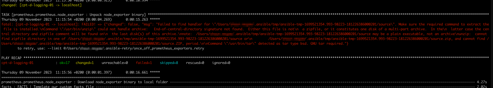
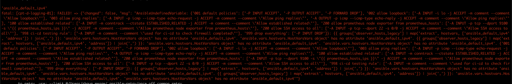

# List of Ansible Errors with Solutions

## Error
objc[50352]: +[__NSCFConstantString initialize] may have been in progress in another thread when fork() was called. We cannot safely call it or ignore it in the fork() child process. Crashing instead. Set a breakpoint on objc_initializeAfterForkError to debug.
ERROR! A worker was found in a dead state

## Solution

```bash
export OBJC_DISABLE_INITIALIZE_FORK_SAFETY=YES

source ~/.zshrc
```

## Error
Failed to find handler for \"/Users/<home>/.ansible/tmp/ansible-tmp-1699521354.993-98223-181226386000201/source\". Make sure the required command to extract the file is installed.\nCommand \"/usr/bin/unzip\" could not handle archive:   End-of-central-directory signature not found.  Either this file is not\n  a zipfile, or it constitutes one disk of a multi-part archive.  In the\n  latter case the central directory and zipfile comment will be found on\n  the last disk(s) of this archive.\nnote:  /Users/<home>/.ansible/tmp/ansible-tmp-1699521354.993-98223-181226386000201/source may be a plain executable, not an archive\nunzip:  cannot find zipfile directory in one of /Users/<home>/.ansible/tmp/ansible-tmp-1699521354.993-98223-181226386000201/source or\n        /Users/<home>/.ansible/tmp/ansible-tmp-1699521354.993-98223-181226386000201/source.zip, and cannot find /Users/<home>/.ansible/tmp/ansible-tmp-1699521354.993-98223-181226386000201/source.ZIP, period.\n\nCommand \"/usr/bin/tar\" detected as tar type bsd. GNU tar required.

{: style="width:80:px"}

## Solution
n macOS it looks for GNU based tar archive module which was not found on mac.
```bash
brew install gnu-tar
```

## Error
'ansible_default_ipv4'
fatal: [cpt-d-logging-01]: FAILED! = {"changed": false, "msg": "AnsibleUndefinedVariable: {'001 default policies': ['-P INPUT ACCEPT'
, '-P OUTPUT ACCEPT', '-P FORWARD DROP'], '002 allow loopback': ['-A INPUT -i 10 -j ACCEPT -m comment --comment
\ "Allow loopback\"'], '003 allow ping replies': ['-A INPUT -p icmp --icmp-type echo-request -j ACCEPT -m comment --comment \"Allow ping replies\"
, '-A OUTPUT -p icmp --icmp-type echo-reply -j ACCEPT -m comment --comment \"Allow ping replies\"'
I, '100 allow established related': ['-A INPUT -m conntrack --ctstate ESTABLISHED,RELATED -j ACCEPT -m comment --comment \"Allow established related\"'], '200 allow prometheus node exporter from prometheus_hosts': ['-A INPUT -p tcp --dport 9100
-s \"ff prometheus _hosts_ips }}\" -j ACCEPT -m comment --comment \"Allow prometheus node exporter from prometheus_hosts\"'], '200 allow SSH access to all': ['-A INPUT -p tcp --dport 22 -s 0/0 -j ACCEPT -m comment --comment \"Allow SSH access to all\"'], '998 ci-ed testing rule': ['-A INPUT -m comment --comment \"used for ci-cd to check firewall completed!"'], '999 drop everything': ['-P INPUT DROP']}: {{ groups['observer_hosts_legacy'] | map('extract' , hostvars, ['ansible_default_ipv4' , 'address']) | join('
,') 33: 'ansible.vars.hostvars.HostVarsVars object' has no attribute 'ansible_default_ipv4'
'ansible.vars.hostvars.HostVarsVars object' has no attribute 'ansible_default_ipv4'. {{ groups['observer_hosts_legacy'] | map('ext
ract', hostvars, ['ansible_default_ipv4'
, 'address']) | join('
,') 33: 'ansible.vars.hostvars.HostVarsVars object' has no attribute 'ansible_default_ipv4'
• 'ansible. vars.hostvars.HostVarsVars object' has no attribute 'ansible_default_ipv4'
• {'001
default policies': ['-P INPUT ACCEPT',
'-P OUTPUT ACCEPT'
, '-P FORWARD DROP'],
'002 allow loopback": ['-A INPUT -i 1o -j ACCEPT -m comment --comment \"Allow loopback\"'], '003 allow ping replies': ['-A INPUT -p icmp --icm-type echo-request -j
ACCEPT -m comment --comment \"Allow ping replies\"', '-A OUTPUT -p icmp --icmp-type echo-reply -j ACCEPT -m comment --comment \"Allow ping replies\"'], '100 allow established related': ['-A INPUT -m contrack --ctstate ESTABLISHED,RELATED -j ACC EPT -m comment --comment \"Allow established related\"'], '200 allow prometheus node exporter from prometheus_hosts': ['-A INPUT -p tcp --dport 9100 -s \"ff prometheus_hosts_ips }}\" -j ACCEPT -m comment --comment \"Allow prometheus node exporte r from prometheus_hosts\"'], '200 allow SSH access to all': ['-A INPUT -p tcp --dport 22 -s 0/0 -j ACCEPT -m comment --comment \"Allow SSH access to all\"'], '998 ci-cd testing rule': ['-A INPUT -m comment --comment \"used for ci-cd to check fir ewall completed\"'], '999 drop everything': ['-P INPUT DROP']}: {{ groups['observer_hosts_legacy'] | map('extract', hostvars, ['ansible_default_ipv4' , 'address']) I join('
,') 33: 'ansible.vars.hostvars.HostVarsVars object' has no attribute 'ansi
ble_default_ipv4'. 'ansible.vars.hostvars.HostVarsVars object' has no attribute 'ansible_default_ipv4"
{{ groups['observer_hosts_legacy'] | map('extract'
, hostvars, ['ansible_default_ipv4'
, 'address']) I join(', ') }}: 'ansible.vars.hostvars.Hos
tVarsVars object' has no attribute 'ansible_default_ipv4'
'ansible.vars.hostvars.HostVarsVars object' has no attribute
'ansible_default_ipv4'

{: style="width:80:px"}

## Solution

This is caused by one or more of your hosts in your inventory being down/inaccessible.
Comment the inaccessible hosts out of your inventory and try again.
