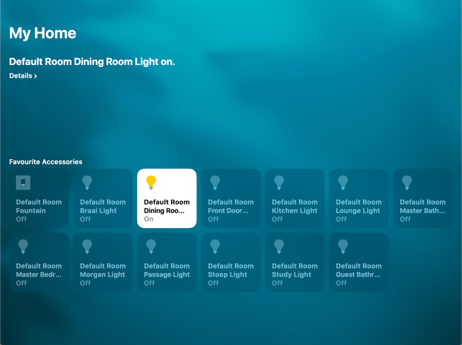

# Home Automation Introduction

## Introduction
I was looking for quick way to do home automation. I needed traditional light switches
as my family wanted the standard wall switches, and came accross qwickswitch which has a 
battery operated rf switch which replaces the current wall mounted manual switch.

I did not want to use an app or service like hassio, and wanted it connected to homekit on Apple so i could control the devices with Siri.

{: style="width:150:px"}

## What you need
You will need the following:

1. Qwickswitch starter pack.

https://qwikswitch.co.za/products/qwik-switch-5a-relay-starter-pack

2. Wifi Bridge

https://qwikswitch.co.za/collections/products/products/wifi-bridge

3. Terminal blocks connectors

https://www.builders.co.za/Electrical/Electrical-Accessories/Builders-Connector-Strip-30amp-(1-Pack)/p/000000000000035443?gclid=Cj0KCQjw2PP1BRCiARIsAEqv-pQBevg5zMJXf68NPvvQ6gNtEnXERCYNbMvkGACWl-Zl6OJhqINbQx8aAkxrEALw_wcB

2. Wifi Bridge

https://www.builders.co.za/Electrical/Electrical-Accessories/Builders-Connector-Strip-30amp-(1-Pack)/p/000000000000035443?gclid=Cj0KCQjw2PP1BRCiARIsAEqv-pQBevg5zMJXf68NPvvQ6gNtEnXERCYNbMvkGACWl-Zl6OJhqINbQx8aAkxrEALw_wcB

3. Terminal blocks

https://diyshop.co.za/products/connector-block?variant=42452941961&currency=ZAR&gclid=Cj0KCQjw2PP1BRCiARIsAEqv-pQ1N3o3-BxtejgfpvNws6TO8hBfn8PzPjELjfIkVbIwXDMgrfeFwmUaAhglEALw_wcB

4. Raspberry pi

https://www.takealot.com/raspberry-pi-4-model-b-4gb-single-board-computer/PLID55393685?gclid=Cj0KCQjw2PP1BRCiARIsAEqv-pQFYX-1KCunKCblnXwPPCvEs_1xDsURDoHf8VyPzNbpcHsdxURzGeUaAtAlEALw_wcB&gclsrc=aw.ds

5. Apple Device such as a iphone or Macbookpro
