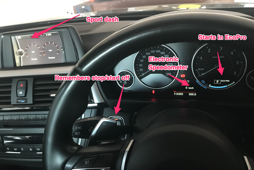
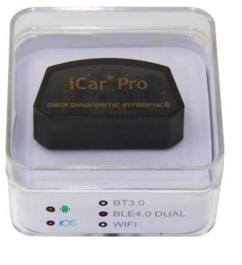
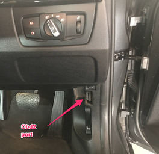
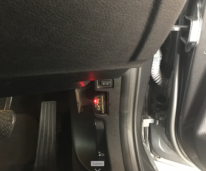
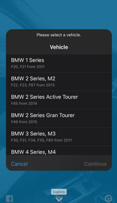
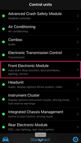
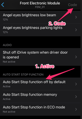
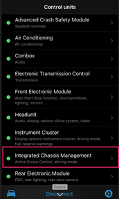
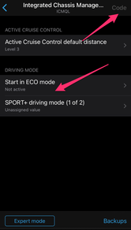

# Bimmercode

## Introduction

I had a few things that were annoying me about my car.
Two things in particular were:

* Having to manually override the stop start function every time I started the car.
* Having to manually put the car into ECO pro mode after each start.

I had a look around and found this could be easily coded out, and there were some other nice features as well.

## Result

I was able to add and change the following using the Vgate Icar Pro and bimmercode.

{: style="width:80:px"}

## What You Need

I bought a Vgate Icar Pro from Takealot:

!!! tip
    https://www.takealot.com/vgate-icar-pro-4-0-obd2-obdii-bluetooth-car-scanner/PLID52292467

{: style="width:80:px"}

I then downloaded bimmercode from the app store.

## How To Do It

Simply plug in the Vgate Icar Pro into you OBD2 port on your car.

{: style="width:80:px"}

{: style="width:80:px"}

Now open bimmercode on your phone and follow the prompts

Tap on Connect.

{: style="width:80:px"}

Select your vehicle model.

{: style="width:80:px"}

Tap on Front Electronic Module.

{: style="width:80:px"}

Tap on Auto Start Stop function off by default and select active, then tap on code.

{: style="width:80:px"}

Tap on Integrated Chassis Management.

{: style="width:80:px"}

Tap on Auto Start in ECO Mode and select active, then tap on code.

{: style="width:80:px"}
