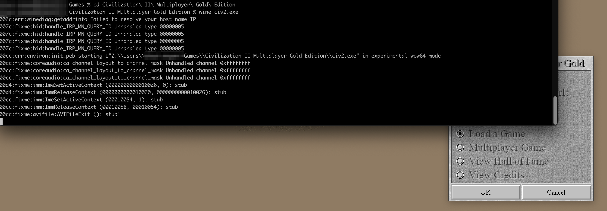

# Assertion failed: curr_mode == stm_32bit

## Introduction

When trying to run Civilization 2 Gold Edition with wine on Macos I get the following error:

```bash
wine Civilization\ II\ Multiplayer\ Gold\ Edition/civ2.exe
```

!!! warning
    Assertion failed: curr_mode == stm_32bit
    
This is simply because it cant find the game files.
You need to run the wine run command in the game directory:

```bash
cd Civilization\ II\ Multiplayer\ Gold\ Edition

wine civ2.exe
```

{: style="width:80:px"}

