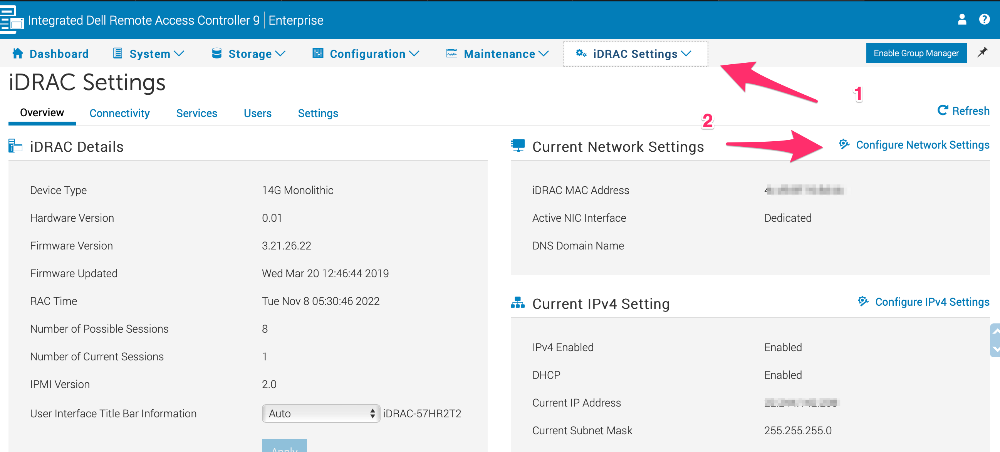
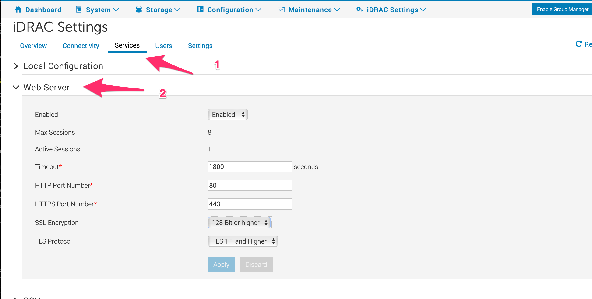

# Dell iDRAC Patch Sweet32

We will go through the steps of patching dell iDRAC Sweet32 vulnerability.

# Patch

To patch sweet32 on the dell iDRAC controllers do the following:
Click on “iDRAC Settings“ > “Configure Network Settings“

{: style="width:80:px"}

Click on “Services“ and then expand “Web Servers“
Set TLS Protocol to TLS 1.2

{: style="width:80:px"}
