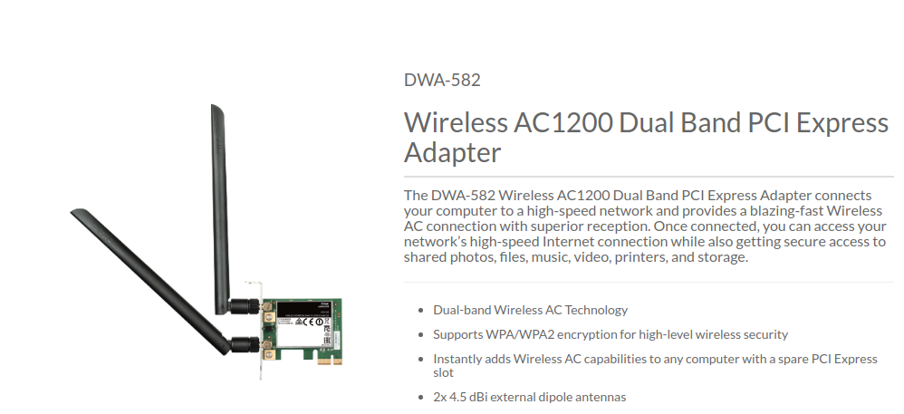

# D-Link Wireless AC1200 Dual Bank PCI Express Adapter on Ubuntu 20.04

## Introduction
These instructions are to install the D-Link Wireless AC1200 Dual Bank PCI Express Adapter on Ubuntu 20.04


{: style="width:150:px"}

## Install

```bash
sudo apt-get install linux-headers-generic build-essential git

git clone https://github.com/mid-kid/r8822be.git

cd r8822be

./make

sudo ./make install

echo "options r8822be aspm=0"  | sudo tee /etc/modprobe.d/r8822be.conf


reboot

```
