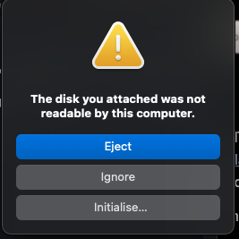
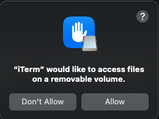
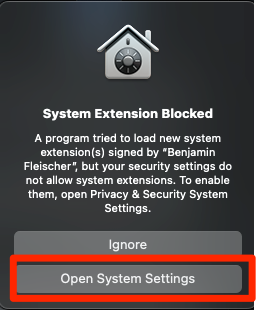
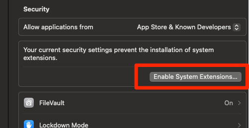
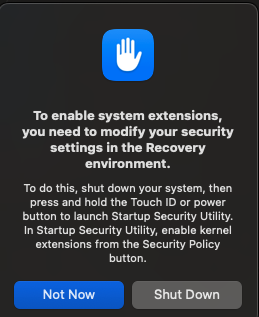

# Mount a ext4 disk on a Mac

## Introduction
I needed to mount an old ext4 usb stick on my Mac. and get the error below when inserting the disk into my mac
{: style="width:80:px"}

## Setup
Install macfuse, using homebrew:
```bash
brew install --cask macfuse
```

Manually clone and compile ext4fuse
```bash
brew install pkg-config
git clone https://github.com/gerard/ext4fuse.git && cd "$(basename "$_" .git)"
make
```

Then create a mount point and mount your external hard drive. If you don't know which drive is the external drive, use diskutil list and figure out which one it is—in my case it was /dev/disk4 (external, physical):
```bash
$ diskutil list 
/dev/disk4 (external, physical):
   #:                       TYPE NAME                    SIZE       IDENTIFIER
   0:      GUID_partition_scheme                        *5.0 TB    disk4
   1:       Microsoft Basic Data                         5.0 TB    disk4s1
```
 Create a mount point for the disk, and then attempt mounting it there:
```bash
mkdir ~/ext4_mount
sudo ./ext4fuse /dev/disk4s1 ~/ext4_mount -o allow_other
```

Allow the mount
{: style="width:80:px"}

You will now get security errors. Click on "Open System Settings"
{: style="width:80:px"}

Click on "Enable System Extentions..."
{: style="width:80:px"}

You will be prompted to reboot
{: style="width:80:px"}
