# Add an EZVIZ camera to homebridge

## Introduction
We will go through the steps of adding an EZVIZ camera to homebridge
so that it can be viewed in Apple Home.
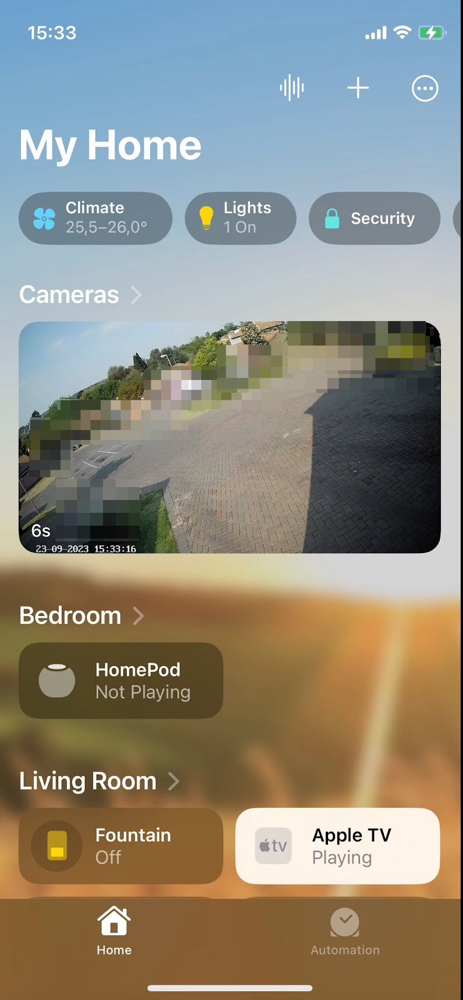{: style="width:80:px"}

## Enable RTSP on EZVIZ

Open the EZVIZ app on your phone and click on the profile button:
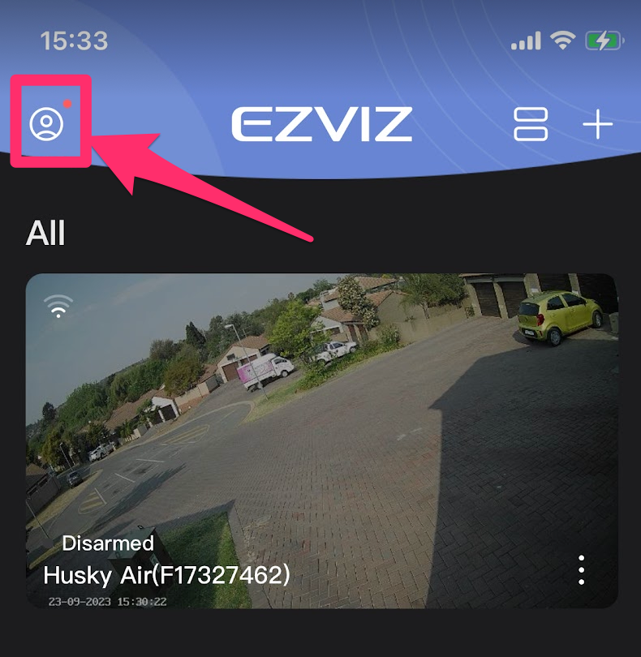{: style="width:80:px"}

Tap on "Settings":
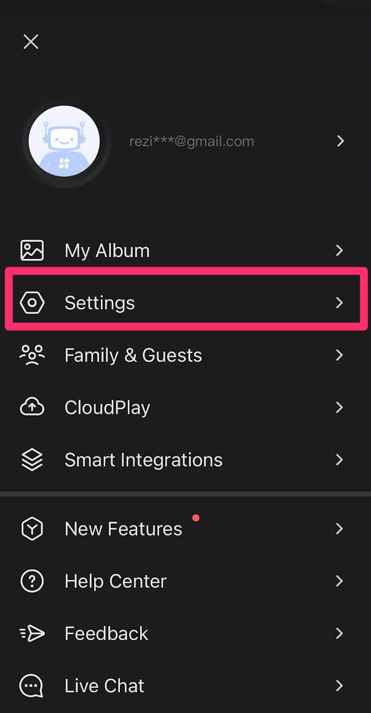{: style="width:80:px"}

Tap on "LAN Live View":
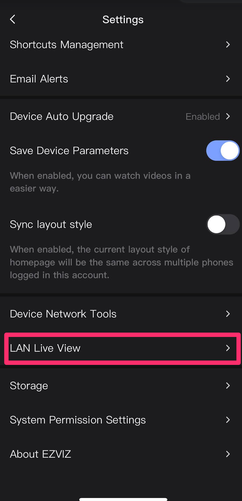{: style="width:80:px"}

Tap on "Start Scanning":
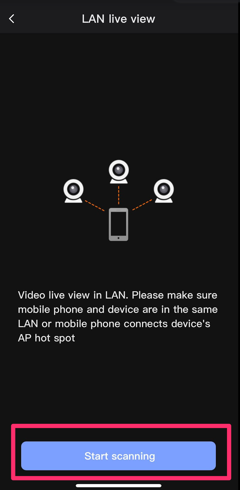{: style="width:80:px"}

Tap on the Camera that comes up:
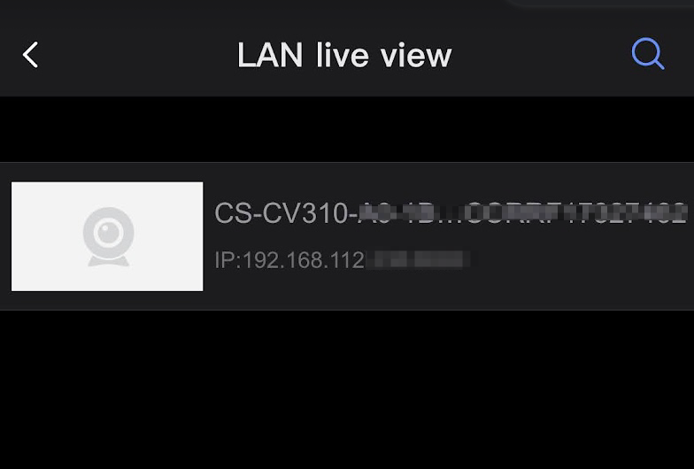{: style="width:80:px"}

Tap on the Gear icon on the top right:
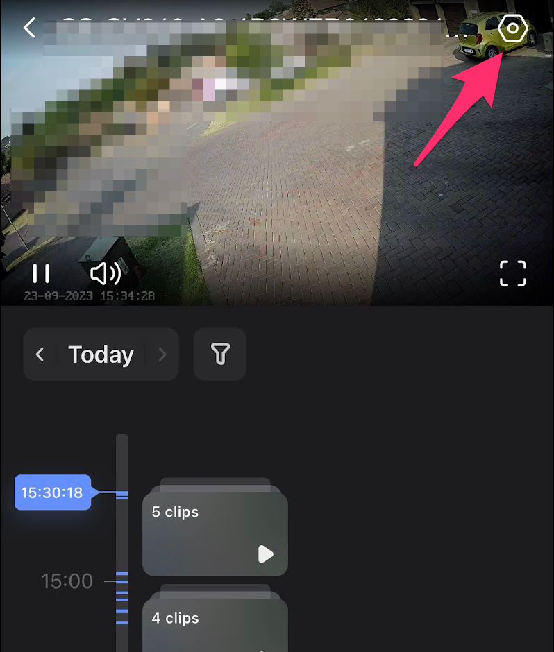{: style="width:80:px"}

Tap on "Local Service Settings":
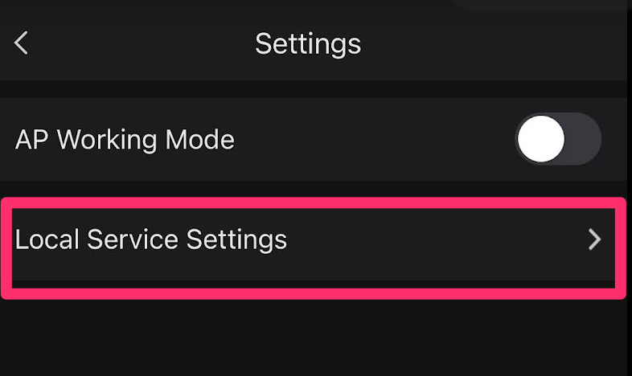{: style="width:80:px"}

Enable RTSP and click on "Save":
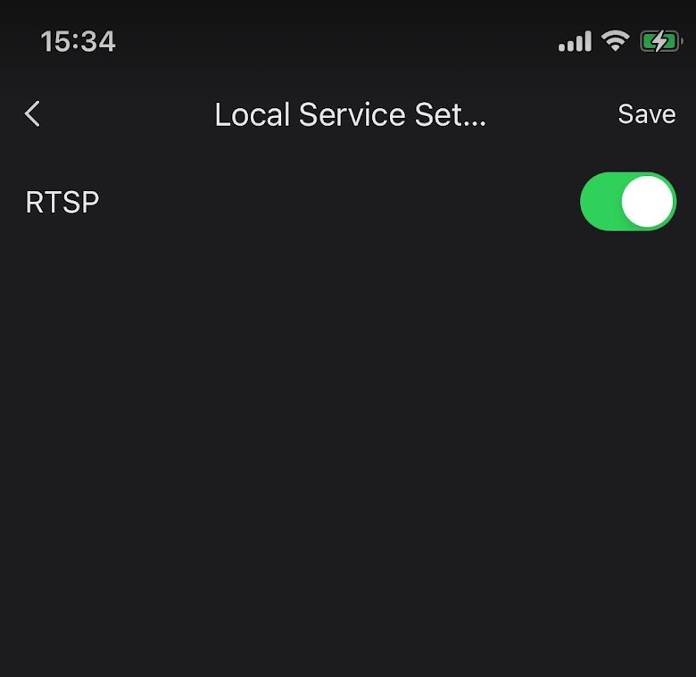{: style="width:80:px"}

## Add to Homebridge

Log into your homebridge install
Click on Plugins and search for "Ezviz" and install the plugin
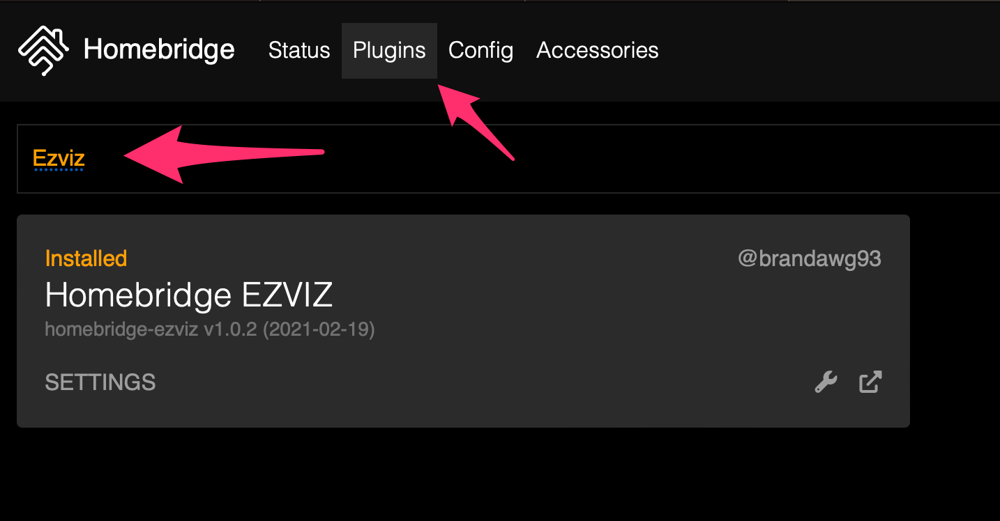{: style="width:80:px"}

Add in your account details and camera details
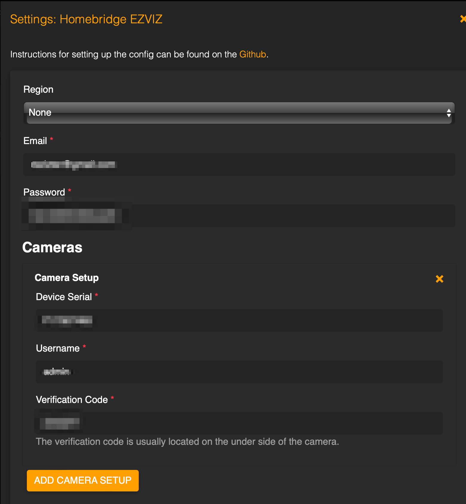{: style="width:80:px"}
