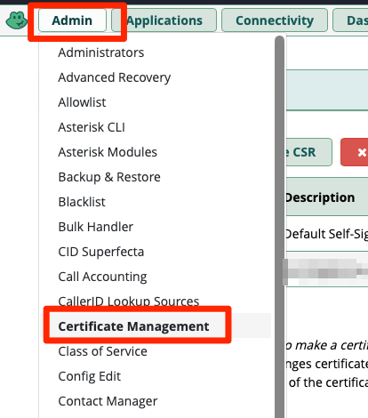
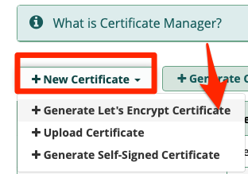
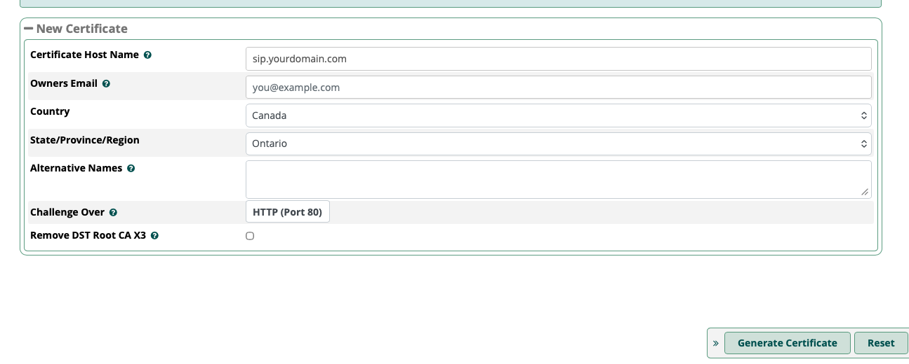
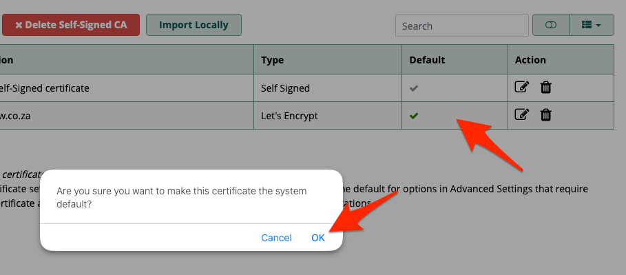
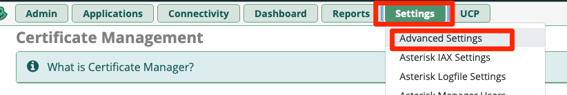
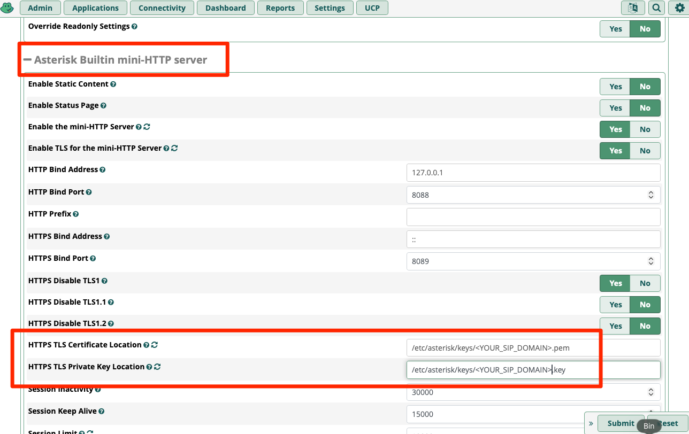
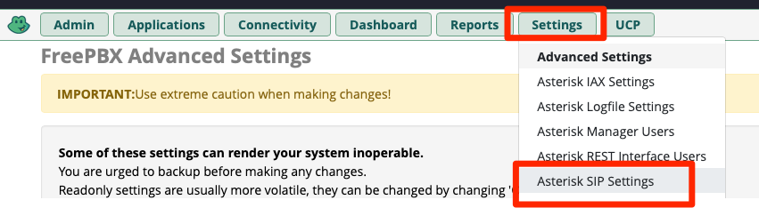
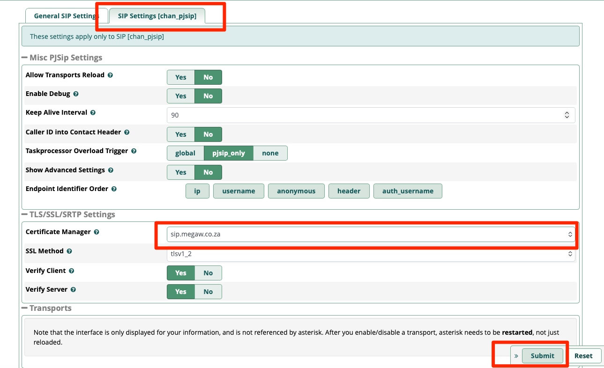

# Add SSL certs to freepbx on Debian 12
## Introduction
We will go hrough the steps of adding lets encrypt ssl certs to theweb gui of freepbx

## Apache HTTPS Setup

Click on "Admin" > "Certificate Management"
{: style="width:80:px"}

Click on "New Certificate" > "Generate Let's Encrypt Certificate"
{: style="width:80:px"}

Fill in your details and then click on "Generate Certificate"
{: style="width:80:px"}

Hover over the block "Default" next to your new certificate and then click over the tick that appears.
You will get a notification, click on "OK"
{: style="width:80:px"}

Now ssh to your sip server to configure apache
```bash
ssh root@<YOURSIPSERVER>
```

Check to see that your letsencrypt certificates are on the filesystem
```bash
ls /etc/asterisk/keys/
```

Edit apache to add the certificate locations:

vi /etc/apache2/sites-available/default-ssl.conf

Edit these lines, replacing it with your domain
!!! note
    Replace <YOUR_SIP_DOMAIN> with the URL / DNS of your FreeSip server
```bash
        SSLCertificateFile      /etc/asterisk/keys/<YOUR_SIP_DOMAIN>.pem
        SSLCertificateKeyFile   /etc/asterisk/keys/<YOUR_SIP_DOMAIN>.key
```

Enable the Apache SSL module and the site configuration:
```bash
a2enmod ssl
a2ensite default-ssl.conf
systemctl restart apache2
```

## Link Certificate to Asterisk (for SIP TLS)
Go to Settings → Advanced Settings.
{: style="width:80:px"}

Search for Asterisk Builtin Mini-HTTP server is set to use your new certificate.
{: style="width:80:px"}

Go to Settings → Asterisk SIP Settings → SIP Settings [chan_pjsip].
{: style="width:80:px"}

Scroll down to TLS and select your certificate from the dropdown menu, Click Submit and Apply Config.
{: style="width:80:px"}


