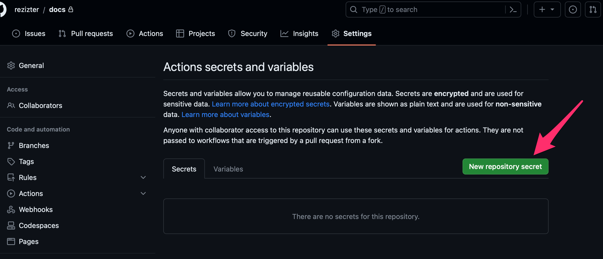
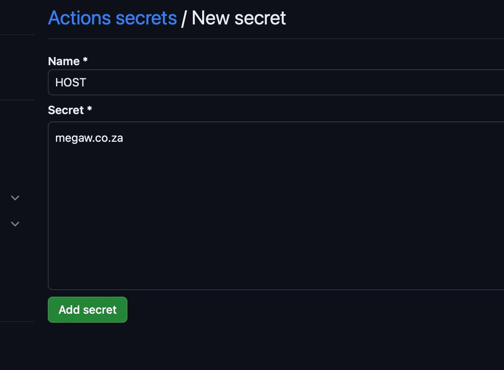
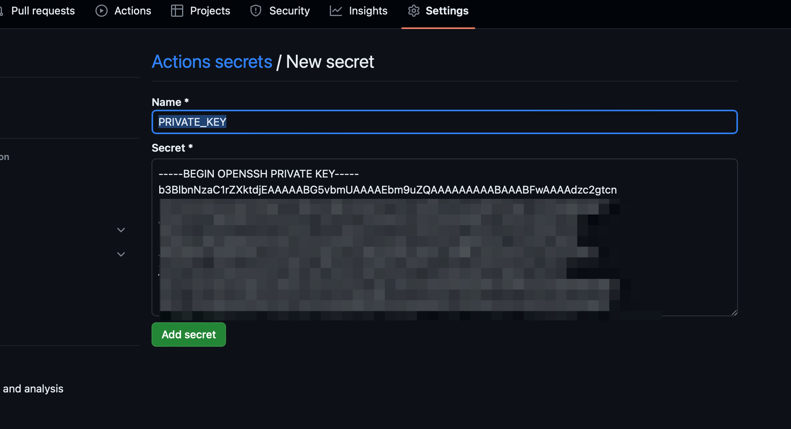
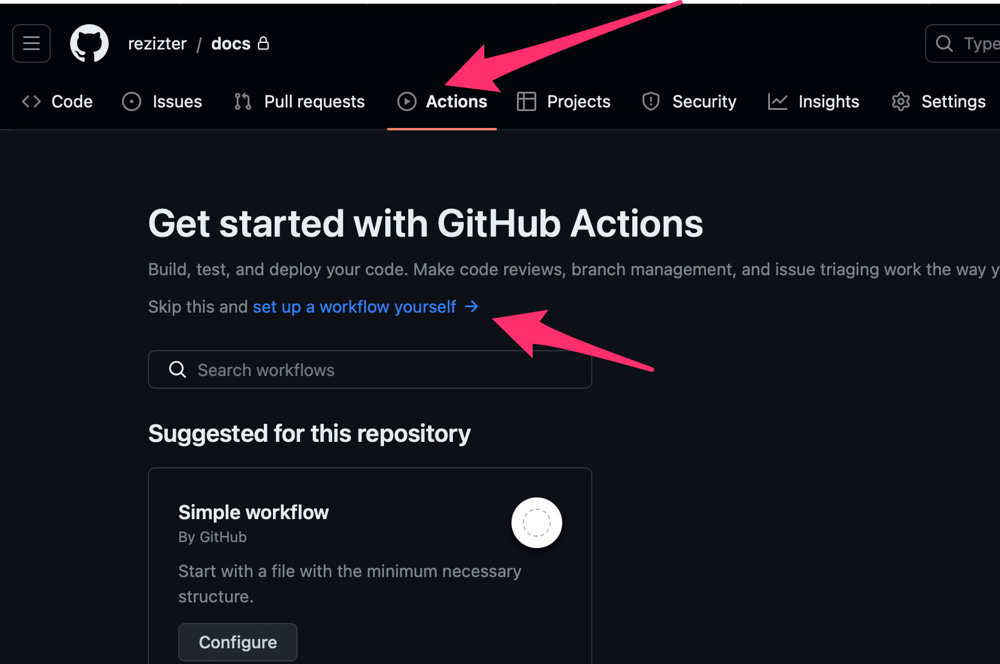
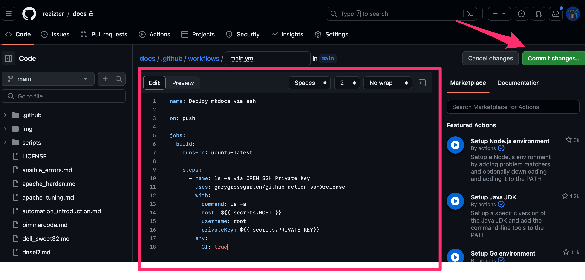
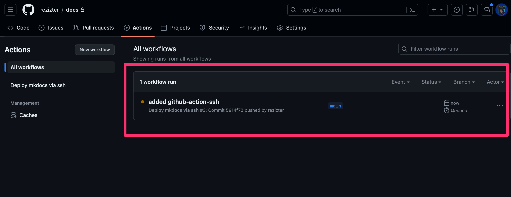

# Deploy mkdocs to a Remote server via ssh using Github Actions

## Introduction

I use Github to store my code for this documentation.
It is served using mkdocs.
I needed a way to auto deploy when I pushed changes
and found GitHub Actions was good for this.

## Setup

### SSH Keys
Generate ssh keys.
```bash
ssh-keygen -b 4096
```

Add the public key to your servers authorized_keys
```bash
vi .ssh/authorized_keys
```

### Create Deploy script
Create a deploy script on your server that hosts your mkdocs install.
```bash
mkdir /opt/scripts
vi /opt/scripts/build_site.sh
```
!!! note
    Replace the venv with your path.
Add
```bash
#!/bin/bash

source ~/.cache/venv/mobile-sre-docs-3.8/bin/activate
cd /var/www/html/docs/docs
LC_ALL=en_US
export LC_ALL
git pull
cd /var/www/html/docs/
mkdocs build --clean
exit 0
```

Make it executable:
```bash
chmod +x /opt/scripts/build_site.sh
```

### Setup Secrets
On the Github site you need to setup your secrets.
Go to:

!!! note
    https://github.com/USERNAME/REPO/settings/secrets
    
Replace USERNAME/REPO with your repo username.

Click on "New repository secrets"
{: style="width:80:px"}

Create a HOST secret:

* Name: HOST
* Secret: your server name or ip:
{: style="width:80:px"}

Now create a PRIVATE_KEY secret:

* Name: PRIVATE_KEY
* Secret: copy in your ssh private key
{: style="width:80:px"}

### Setup Action
Now go to your project on Github

Click on Actions >  set up a workflow yourself
{: style="width:80:px"}

Add the following:
```bash
---
name: Deploy mkdocs via ssh

on: push

jobs:
  build:
    runs-on: ubuntu-latest

    steps:
      - name: Deploy mkdocs to a remote server
        uses: garygrossgarten/github-action-ssh@release
        with:
          command: /opt/scripts/build_site.sh
          host: ${{ secrets.HOST }}
          username: root
          privateKey: ${{ secrets.PRIVATE_KEY}}
        env:
          CI: true
```

Once added commit changes:
{: style="width:80:px"}

Your build will now show up in the "Actions" menu
{: style="width:80:px"}
