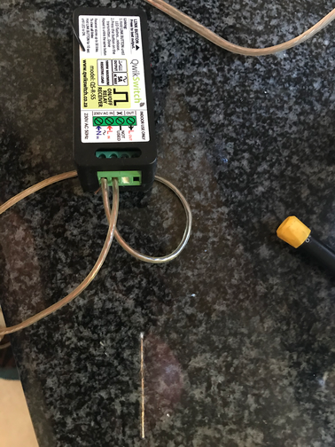
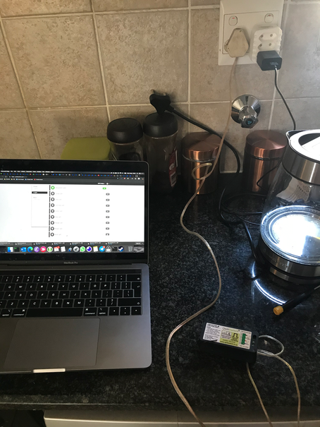
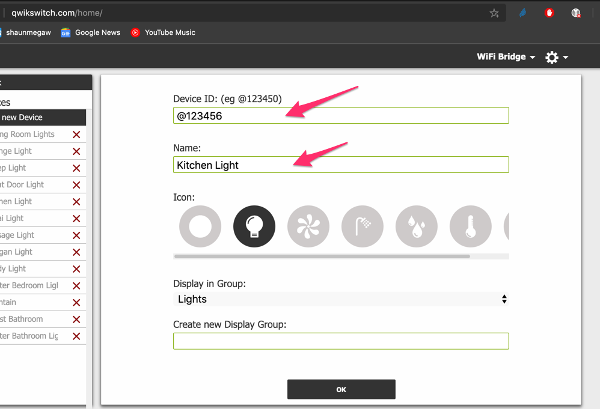
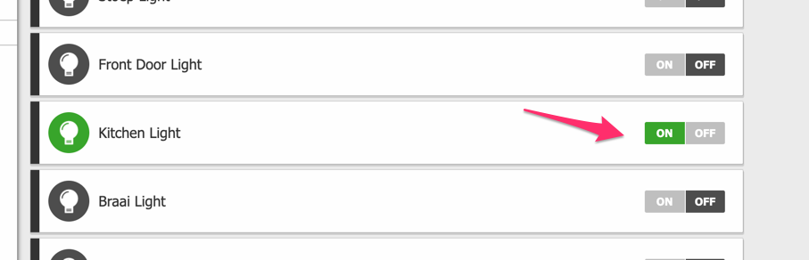
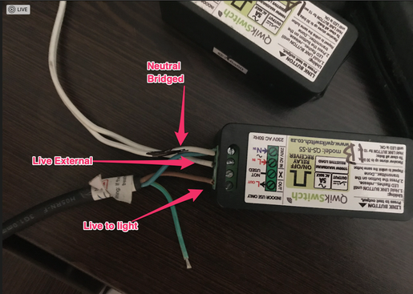
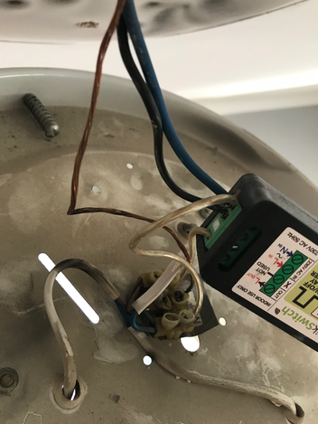
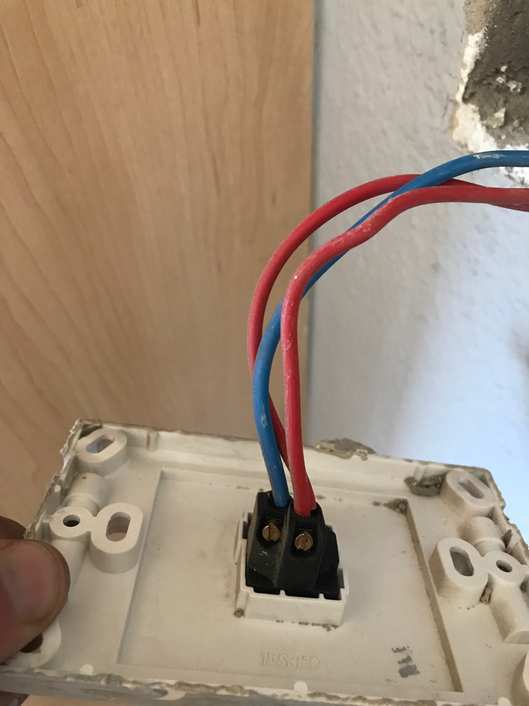
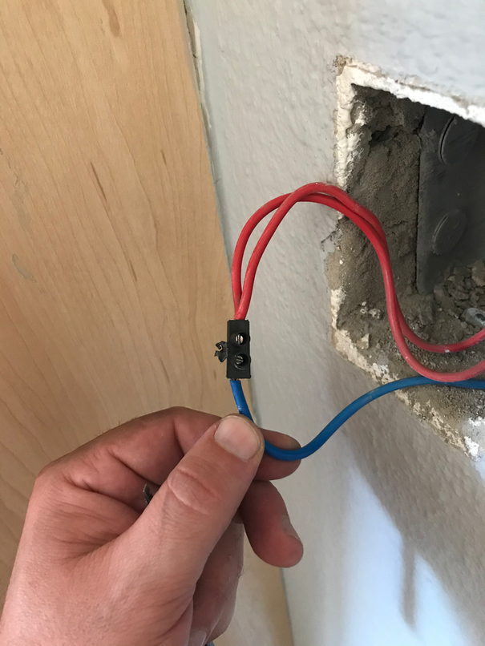
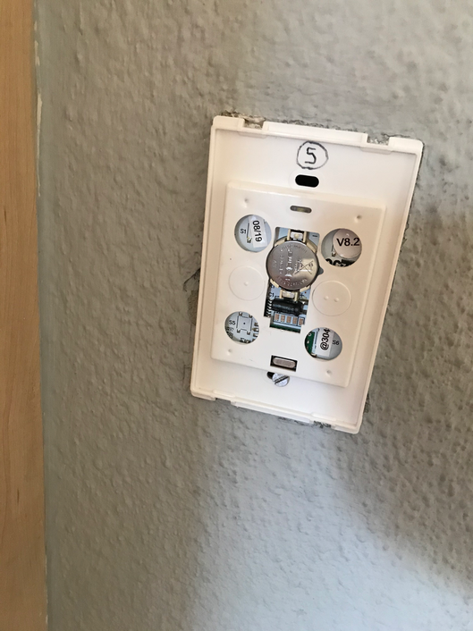

# Install Qwickswitch hardware
We will go through the steps of installing quickswitch hardware.

!!! tip
    You can purchase the devices from
    https://qwikswitch.co.za/products/qwik-switch-5a-relay-starter-pack

## Program Relay

I found it easier to program the relay and then install it. 
Connect wire to a plug and then conect the other end to the relay.

Nuetral goes into **N in**

Live goes into **L in**

{: style="width:150:px"}

Now plug into the wall socket to give it power.

{: style="width:150:px"}

## Link RF wall molunted switch

Hold the link button on the side down until the led light flashes, and then click on the RF switch button. this will pair the wall mounted switch.

## Add to your cloud account

!!! note
    Make a note of the @number on the side of the relay, you will use this to add your device to your qwikswitch account.
    
    Go to http://qwikswitch.com/home/

Click on "Device Setup" and add the details.

{: style="width:150:px"}

Turn the device switch on, you should hear a click on the relay.

{: style="width:150:px"}

## Connect Relay

The basics are bridge Neutral and live is the switch.

!!! warning
    Ensure you turn your main power off to your house.

Unscrew you light from the ceiling, you will see a blue and black/brown wire go into a terminal block, usually attached to your light, unscrew these wires.

Connect the live from the ceiling (power) to  **L in**.

Connect Neutral from the ceiling (power) and the blue (neutral wire from the light) to  **N in**.

Connect the brown wire from the light to the **L Out** of the relay.

Here is a pic of what to do.

{: style="width:150:px"}

This is what it looks like on the actual light.

{: style="width:150:px"}

Screw the light back to the ceiling.

## Manual Switch (rf switch)

Now you need to unscrew the old wall switch off, and remove the wires.

{: style="width:150:px"}

Now bridge the wires using a terminal block.

{: style="width:150:px"}

Screw in the Qwikswitch RF switch.

{: style="width:150:px"}

