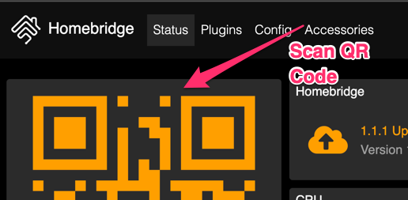

# Homebridge setup for QwikSwitch 

## Introduction

We now have our QwikSwitch devices installed and setup, as per this document:
[Install QwikSwitch Hardware](./home_qwikswitch.md)

We will go through the steps of setting up each QwikSwitch relay to homebridge, so that we can contol our devices via Apple HomeKit.

You will need a Raspberry Pi, setup with Raspberian and Homebridge.

!!! note
    [https://github.com/homebridge/homebridge/wiki/Install-Homebridge-on-Raspbian](https://github.com/homebridge/homebridge/wiki/Install-Homebridge-on-Raspbian)
    
You will need to have your QwikSwitch cloud account with your devices added:

!!! note
    [https://cdn.shopify.com/s/files/1/1883/0535/files/Wifi_Bridge_installation_manual.pdf?1249757111596261533](https://cdn.shopify.com/s/files/1/1883/0535/files/Wifi_Bridge_installation_manual.pdf?1249757111596261533)
    
## API Calls

You will need an api client, like insomnia to connect to your QwikSwitch account and build the xml:
 
!!! note 
    [https://insomnia.rest/](https://insomnia.rest/)
    
Right click and then click on "new request".

{: style="width:150:px"}

Call it "auth" and select "POST" and change "no body" to "JSON" then click on "Create".

{: style="width:150:px"}

You will need your email address from your QwikSwitch account, as well as the cloud key, printed on your WIFI bridge:

* email: Email address from your QwikSwitch account
* masterKey: Cloud key, printed on your WIFI bridge
* url: https://qwikswitch.com/api/v1/keys

Paste in the following:

```bash
{
	"email": "youremail@gmail.com",
	"masterKey": "12er569fetp"
}
```

Next to "POST", paste in the following url:

```
https://qwikswitch.com/api/v1/keys
```

Now click on "Send"

Copy the output "rw": XXXXXXXXX This is your api key.

{: style="width:150:px"}

Right click and click on "new request"

{: style="width:150:px"}

Call it "status" and select "get" and then click on "create"

{: style="width:150:px"}

Add the following URL, replacing XXXXXXX with your api key you got in the auth step above.

Next to "GET", paste in the following url:

```
http://qwikswitch.com/api/v1/state/XXXXXX/
```

Now click on "Send":

!!! note
    Make a note of the order of the devices, as this is how you will need to add them to homebridge.

{: style="width:150:px"}

## Homebridge

### Connect HomeBridge To Your Apple HomeKit

Navigate to the ip of your homebridge server and login with:

* Username: admin
* Password: admin

!!! note 
    http://ip.of.pi:8581
    
{: style="width:150:px"}

You will see a QR code, you will need to scan this code with your iphone

{: style="width:150:px"}

Open Apple HomeKit on your iphone and click on the <kbd>+</kbd> and then click on "Add Accessory". 

{: style="width:150:px"}

Now scan the QR Code on the homebride web page, and this will add HomeBridge as a bridge to your account.

{: style="width:150:px"}

### Accessories

Go back to your Homebridge web GUI and click on Plugins and install the following 2 plugins:

* homebridge-http-lightbulb
* homebridge-http-switch

{: style="width:150:px"}

Click on "Config" and and replace the contents of accessories with the below:

!!! note
    Replace the following with your settings:

    * XXXXXXXX - api key
    * @2c11111 - Qwikswitch replay device 1
    * @2d22222 - Qwikswitch replay device 2
    * @2e33333 - Qwikswitch replay device 3

``` bash

    "accessories": [
        {
            "accessory": "HTTP-LIGHTBULB",
            "name": "Kitchen Light",
            "onUrl": "http://qwikswitch.com/api/v1/control/XXXXXXX/?device=@2c11111&setlevel=100",
            "offUrl": "http://qwikswitch.com/api/v1/control/XXXXXXX/?device=@2c11111&setlevel=0",
            "statusUrl": "http://qwikswitch.com/api/v1/state/XXXXXX/",
            "statusPattern": "@2c11111(.|\n)*value\":1(.|\n)*@2d22222"
        },
        {
            "accessory": "HTTP-LIGHTBULB",
            "name": "Lounge Light",
            "onUrl": "http://qwikswitch.com/api/v1/control/XXXXXXX/?device=@2d22222&setlevel=100",
            "offUrl": "http://qwikswitch.com/api/v1/control/XXXXXXX/?device=@2d22222&setlevel=0",
            "statusUrl": "http://qwikswitch.com/api/v1/state/XXXXXXX/",
            "statusPattern": "@2d22222(.|\n)*value\":1(.|\n)*@2e33333"
        },
        {
            "accessory": "HTTP-SWITCH",
            "name": "Fountain",
            "onUrl": "http://qwikswitch.com/api/v1/control/XXXXXXXXXX/?device=@2e33333&setlevel=100",
            "offUrl": "http://qwikswitch.com/api/v1/control/XXXXXXXXX/?device=@2e33333&setlevel=0",
            "statusUrl": "http://qwikswitch.com/api/v1/state/XXXXXXXX/",
            "statusPattern": "@2e3333(.|\n)*value\":1(.|\n)"

        }
    ],
    "platforms": [
        {
            "name": "Config",
            "port": 8581,
            "platform": "config"
        }
    ]
}
```

You must keep your device id in the exact order of the output of your api call.

{: style="width:150:px"}

Note the order in **StatusPattern**.

StatusPattern is a regex between 2 devices, so you have to have the 2 devices in order to get the correct
on and off status.

{: style="width:150:px"}

