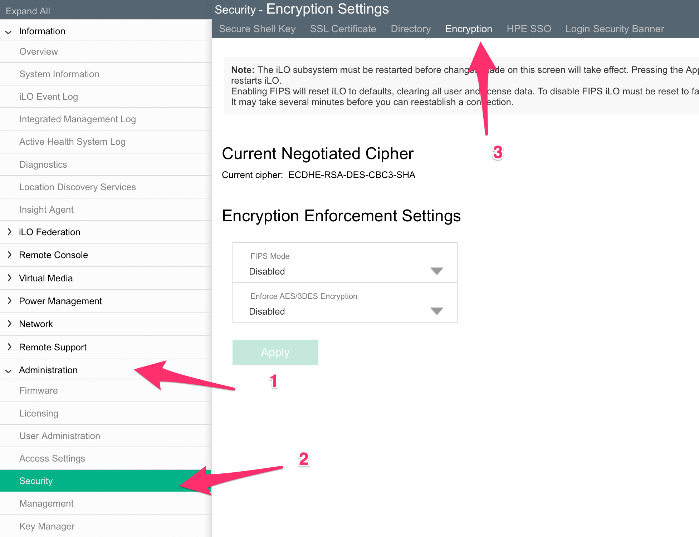
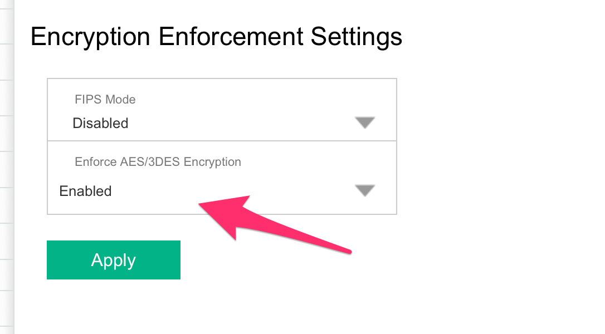
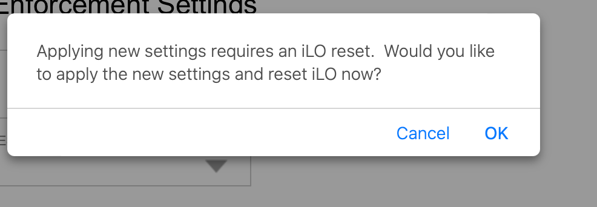

# Patch Sweet32 on HP iLO 4

We will go through the steps of patching the sweet32 vulnerability

# Enforce AES/3DES Encryption

Click on “Administration” > “Security“

Then click on “Encryption”

{: style="width:80:px"}

Click on “Enforce AES/3DES Encryption” and Select “Enable” and then click on Apply

{: style="width:80:px"}

The ILo will reset, click on “OK”

{: style="width:80:px"}
