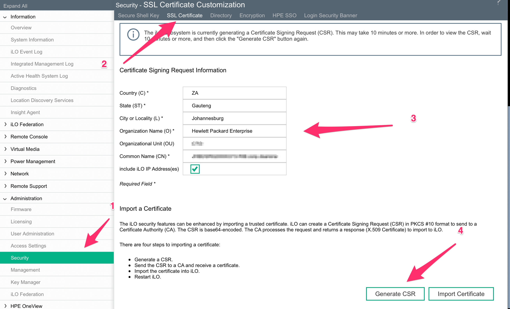
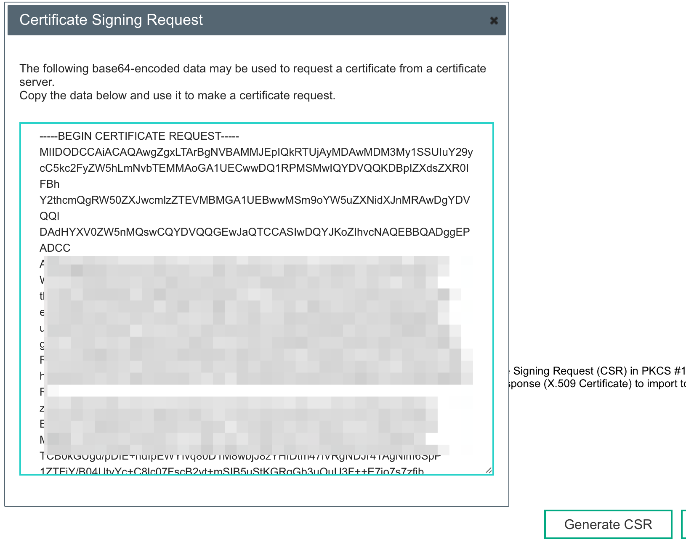
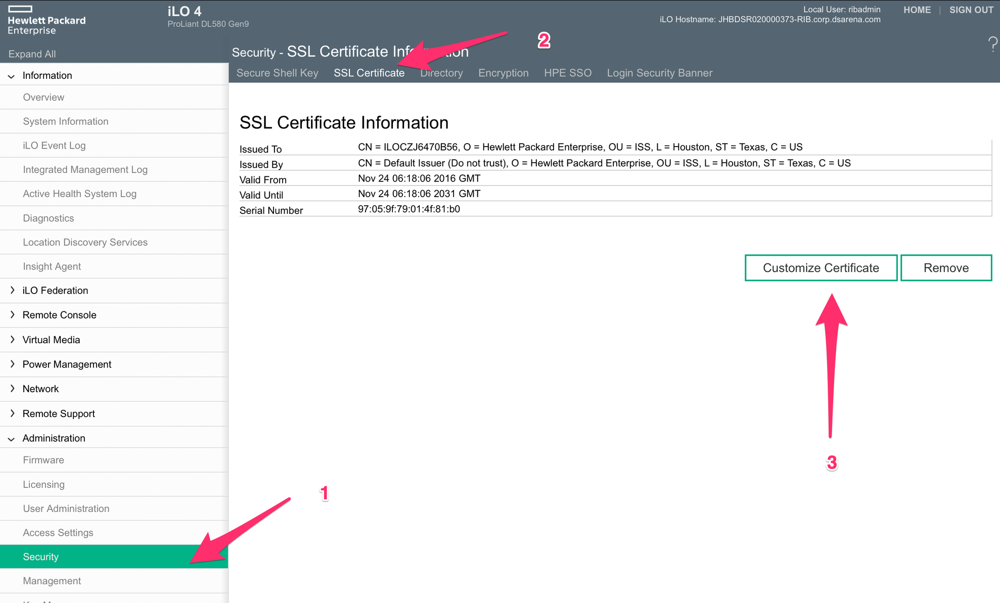
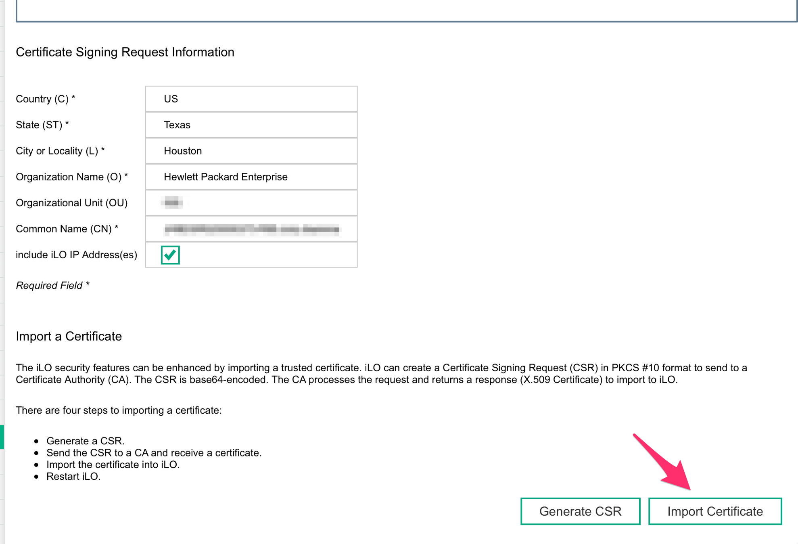
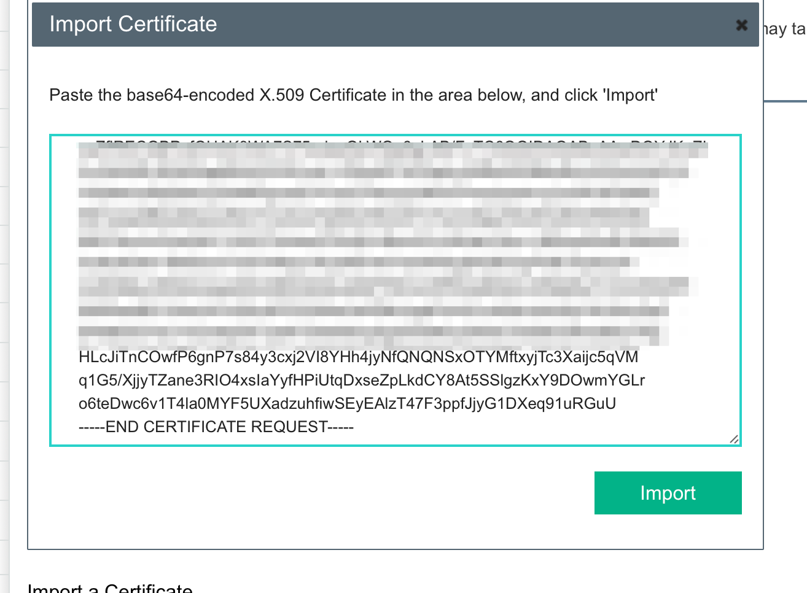
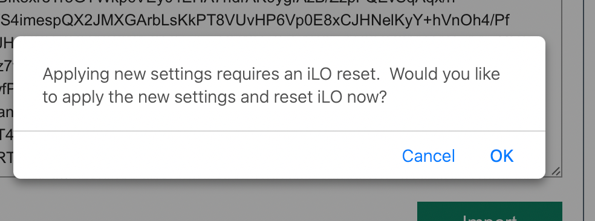
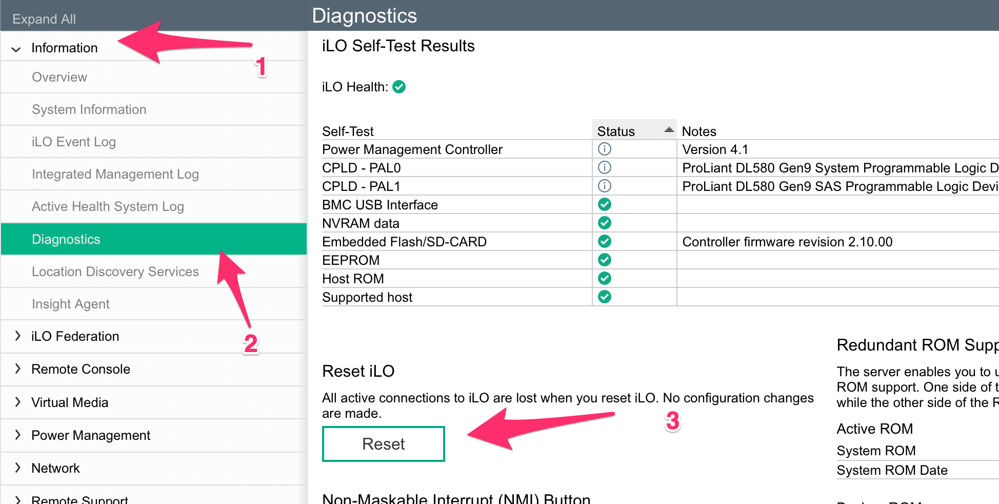

# HP iLo 4 Weak Hashing Algorithm Patch

Default format these servers have SSL Certificate Signed Using Weak Hashing Algorithm.

To fix this we need to upload self signed certificates that are signed with a stronger algorithm.

!!! note
    Change Common name to the ip of the server you are generating the certificate for

- Click on “Administration” > “Security”
- Click on “SSL Certificate“
- Update the details of the certificate
- Click on “Generate CSR”
- Wait 10 minutes and then Click on “Generate CSR”

{: style="width:80:px"}

After 10 minutes when you click on Generate CSR again a pop up block will appear. Copy this certificate to a file.

{: style="width:80:px"}

# Test Certificate

!!! note
    Change 373.csr with them name you saved from above.
    
```bssh
openssl req -in 373.csr -text -noout | grep -i "Signature.*SHA256" && echo "All is well" || echo "This certificate will stop working in 2017! You must update OpenSSL to generate a widely-compatible certificate"
```

The results should show

!!! tip
    All is well

# Import Certificate

- Go to the iLo4 web interface. 
- Click on ""Administration" > "Security"
- Then Click on SSL Certificate
- Click on “Custom Certificate“

{: style="width:80:px"}

Click on Import certificate.

{: style="width:80:px"}

Paste the CSR from your clipboard and click on “Import”.

{: style="width:80:px"}

Now the iLo interface will restart.

{: style="width:80:px"}

# Reset iLO

Now reset iLo to apply.

- Click on “Information“ > “Diagnostics“.
- Click on Reset.

{: style="width:80:px"}
