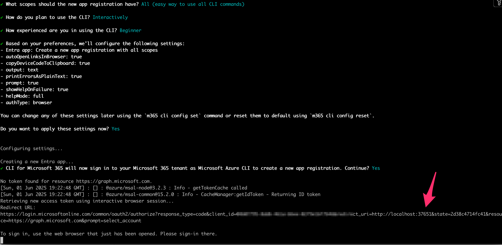
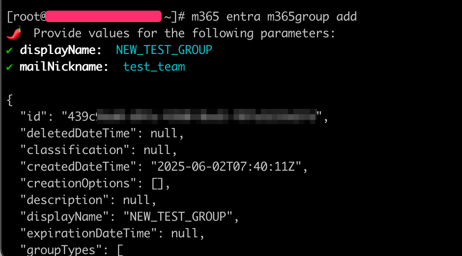
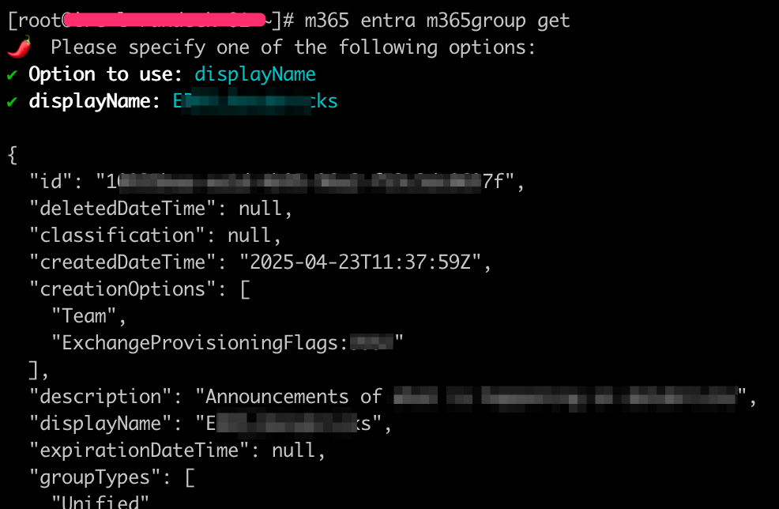
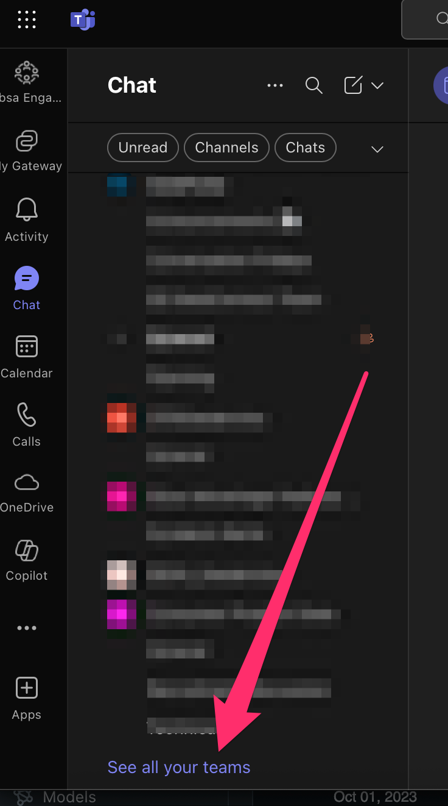
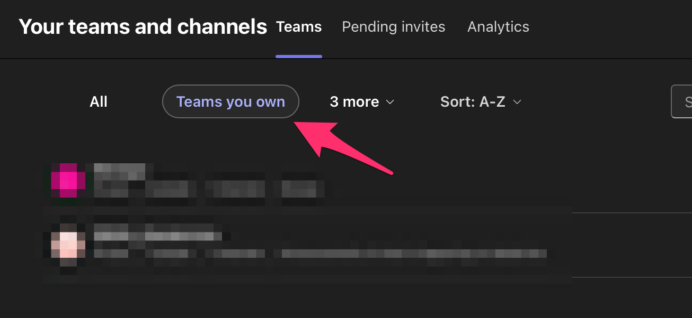

# Microsoft m365-cli

# Installation
Install npm using:
```bash
npm install -g @pnp/cli-microsoft365
```

You may need to set the path:

```bash
vi ~/.bashrc
```

Add the following to the bottom

```bash
if [ -d "/usr/local/bin" ] ; then
  PATH="$PATH:/usr/local/bin"
fi
```
Now add to bash
```bash
source ~/.bashrc
```

# Login
!!! note
    These instructions are for a remote headless server without a browser.

Run the following command
```bash
m365 setup --debug
```

You will get a url. Note the port number and then run a new ssh terminal
forwarding the port to your local machine:
!!! note
    In my example the port is 37651, howeever it is a random port each time

{: style="width:80:px"}

Forward your local port with:
```bash
ssh root@<yourserver> -L 37651:localhost:37651
```

Now copy the full link and paste it in your local browser to authenticate.

# Confirm credentials
Run:
```bash
m365 status
```

# Create a Microsoft Teams Group
## Create a group
Run the following:
```bash
m365 entra m365group add
```
Now type in a group name and team name
{: style="width:80:px"}

## See the groups details
```bash
m365 entra m365group get
```
Under "Option to use:"
Select "displayName"

Now type in the groups name
{: style="width:80:px"}

# Add users to a Teams group

!!! note
    You get the groupID from the step above
    Replace yourname.yoursurname@yourdomain.com with the users details

```bash
m365 entra m365group user add --groupId 100000aa-ea12-4b123-9a123-f1111111 --userNames "yourname.yoursurname@yourdomain.com" --role member
```

## View the group in Microsoft Teams
Open teams, click on the chats and scroll to the bottom.
Click on "See all your teams"
{: style="width:80:px"}

Click on "Teams you own" and you should see it in the drop down
{: style="width:80:px"}
