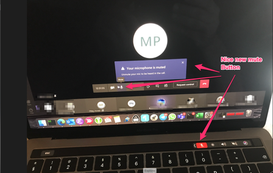

# Usefull Applications for mac
## Introduction
This is a collection of very usefull applications I use for Mac

## Switch DNS on Wifi

### Introduction
To quickly switch dns on your mac via cli run the following

### Setup

!!! note
    Change 8.8.8.8 to your DNS of choice.

```bash
networksetup -setdnsservers Wi-Fi 8.8.8.8
```

## Homebrew

### Introduction

We will go through the steps of setting up homebrew on MacOS Big Sur

### Setup

```bash
ruby -e "$(curl -fsSL https://raw.githubusercontent.com/Homebrew/install/master/install)"
```

Now setup your paths.

```bash
echo export PATH="/usr/local/bin:$PATH:/opt/homebrew/bin" >> ~/.zshrc

source ~/.zshrc
```

### Test
Test by running the following:

```bash
brew install emacs
```

## Mute-me

### Introduction
Having to use teams for meetings, i used to have to find the mute button in a meeting, which I usually forgot to do. This ment that the atendees usually landed up listing to my favorite songs, and everyone listen to my dog snore.

Muteme adds a nice mute shortcut to your touchbar

### Install

!!! note
    Download from Github:
    https://github.com/pixel-point/mute-me/releases/tag/v2.0.0-rc2
    
And thats it! Now you have a nice shiny new mute button added to your touchbar.

{: style="width:150:px"}

### Usage
1. Tap to mute /unmute
2. long hold to bring up settings
3. Shift + Command + 0 (zero) for keyboard shortvut to toggle mute / unmute

## Skitch

### Introduction
I like screenshots, and highlighing items in screenshots ... enter Skitch.

### Install
Download skitch 
!!! note
    https://evernote.com/products/skitch
    
Installation is striaght forward, simply folow prompts

### Usage

Once Skitch is running, there's no need to switch to the Skitch window to capture a snapshot. Just click and hold on the Skitch icon in the application dock. A snapshot menu will appear that allows you to do any of the following:

- Crosshair snapshot
- Previous snapshot area
- Fullscreen snapshot
- Window snapshot
- Menu snapshot
- Camera snapshot
- The captured image will automatically be opened in Skitch.

### Keyboard shortcuts
The following are some of the useful keyboard shortcuts that are available:

**Capturing**

- Crosshair Snapshot: Shift + Command + 5
- Fullscreen Snapshot: Shift + Command + 6
- Window Snapshot: Shift + Command + W
- Camera Snapshot: Shift + Command + T
- Annotating
- Arrow: Option + Command + A
- Text: Option + Command + T
- Rectangle: Option + Command + R
- Rounded Rectangle: Option + Command + U
- Ellipse: Option + Command + O
- Line: Option + Command + L
- Marker: Option + Command + M
- Highlighter: Option + Command + I
- Pixelate: Option + Command + X
- Crop/Resize: Option + Command + K
- Tool Size: Option + Command + 1 through Option + Command + 5

**Sharing**

- Share via email: Shift + Command + M
- Create Public Link and copy URL: Command + /
