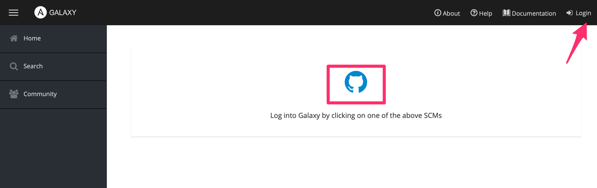
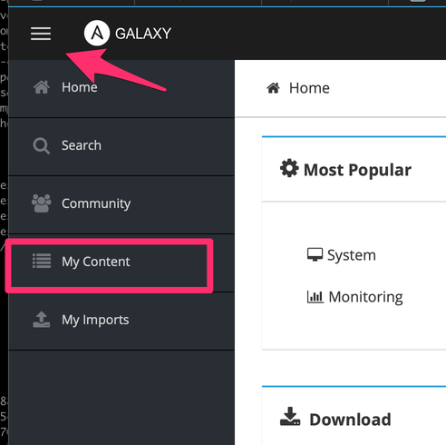
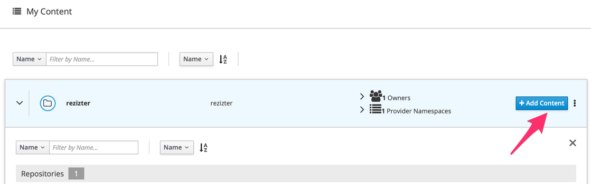
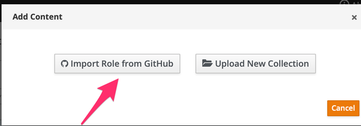
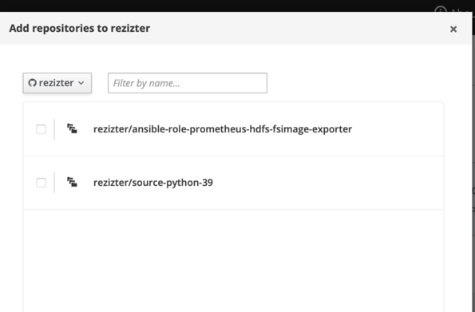
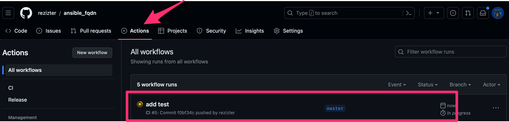

# Test Ansible role with Molecule on Macos

## Introduction
We will go through the steps of creating a molecule test for your role.
This will test a roll for CentOS7 on MacOS.

## Setup

### Install Docker on your mac

```bash
softwareupdate --install-rosetta
brew install --cask docker
open /Applications/Docker.app
```

### Upload your role to Galaxy

!!! note
    The address for Galaxy is:
    
Click on "Login" and then click on the Github icon

{: style="width:80:px"}

Click on "My Content"

{: style="width:80:px"}

Click on "Add Content"

{: style="width:80:px"}

Click on "Import Role from GitHub"

{: style="width:80:px"}

Click on the role you want to import and click on "Ok"

{: style="width:80:px"}

### Setup the Molecule role

!!! note
    The  <ROLE_NAME> must match your full username
    and role name on GitHub. EG: rezizter.ansible_fqdn

```bash
molecule init role --driver-name docker <ROLE_NAME>
```
Now copy your role into this folder
```bash
cp -r your_repo/molecule <ROLE_NAME>/
cp -r your_repo/tests <ROLE_NAME>/
```

Now create the molecule file:
```bash
mkdir -p molecule/default
vi molecule/default/molecule.yml
```

Add: 
```bash
---
dependency:
  name: galaxy
driver:
  name: docker
platforms:
  - name: centos-8
    image: quay.io/centos/centos:stream8
    pre_build_image: true
    command: /usr/sbin/init
    privileged: true
provisioner:
  name: ansible
verifier:
  name: ansible
```

Create a meta file which references your role:
```bash
meta/main.yml
```

Add:
```bash
galaxy_info:
  role_name: <ROLE_NAME>
  description:
  license: <YOUR LICENSE>

  min_ansible_version: 2.8

  platforms:
    - name: el
      versions:
        - 7
        - 8
  galaxy_tags:
    - logging
dependencies: []
```

Now create the converge file:
```bash
vi molecule/default/converge.yml
```

Add:
```bash
---
- name: Converge
  hosts: all
  tasks:
    - name: "Include <ROLE_NAME>"
      include_role:
        name: "<ROLE_NAME>"
```

Create a verify file
```bash
vi molecule/default/verify.yml
```

Add:
```bash
---
# This is an example playbook to execute Ansible tests.

- name: Verify
  hosts: all
  gather_facts: false
  tasks:
    - name: Example assertion
      ansible.builtin.assert:
        that: true
```

Create a github directory
```bash
mkdir -p .github/workflows
vi .github/workflows/ci.yml
```

Add
```bash
---
name: CI
'on':
  push:
    branches:
      - master
  schedule:
    - cron: "30 8 * * 0"

defaults:
  run:
    working-directory: '<ROLE_NAME>'

jobs:

  lint:
    name: Lint
    runs-on: ubuntu-latest
    steps:
      - name: Check out the codebase.
        uses: actions/checkout@v3
        with:
          path: '<ROLE_NAME>'

      - name: Set up Python 3.
        uses: actions/setup-python@v3
        with:
          python-version: '3.x'

      - name: Install test dependencies.
        run: pip3 install yamllint

      - name: Lint code.
        run: |
          yamllint .

  molecule:
    name: Molecule
    runs-on: ubuntu-latest
    strategy:
      matrix:
        include:
          - distro: centos-8
            playbook: converge.yml

    steps:
      - name: Check out the codebase.
        uses: actions/checkout@v3
        with:
          path: 'rezizter.ansible_fqdn'

      - name: Set up Python 3.
        uses: actions/setup-python@v3
        with:
          python-version: '3.10'

      - name: Install test dependencies.
        run: pip3 install ansible molecule molecule-plugins[docker] docker

      - name: Run Molecule tests.
        run: molecule test
        env:
          PY_COLORS: '1'
          ANSIBLE_FORCE_COLOR: '1'
          MOLECULE_DISTRO: ${{ matrix.distro }}
          MOLECULE_PLAYBOOK: ${{ matrix.playbook }}
```

### Yamllint

This is a tool to check the linting of your code before you push to Github

```bash
yamllint .
```

### Push the code to Github

```bash
git add -A
git commit -m "add ci and release"
git push
```

### Test using Molecule

!!! note
    Docker needs to be running locally on your machine to test
    
Run the following command to test Converge
```bash
molecule converge
```

### Github Action

Once you have pushed to github in the step above,
You will see the action testing your code on a
CentOs8 docker image.

Go to your repo on GitHub and click on "Actions"

{: style="width:80:px"}


## Notes

### Set Cgroup Version to 1

```bash
sed -i '' -e 's/"deprecatedCgroupv1": false/"deprecatedCgroupv1": true/g' Library/Group\ Containers/group.com.docker/settings.json
```

Restart Docker

```bash
killall Docker
open /Applications/Docker.app
```
