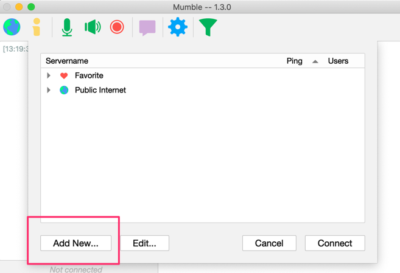

# Install & Setup the Mumble client
## Client Download
Download the client software for your operating system

!!! tip
    https://www.mumble.com/mumble-download.php

## Join a server
Open the mumble application
You can either join one of the public internet servers, or a dedicated server.
To join a dedicated server click on "Add New"

{: style="width:150:px"}

Fill in the details

{: style="width:150:px"}

Click on the server you added and then click "Connect"

{: style="width:150:px"}
