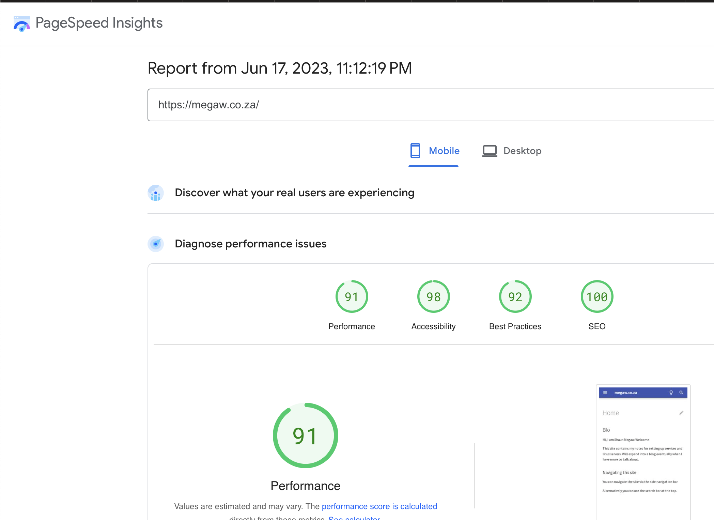

# Pagespeed for Apache on CentOS 8

## Introduction
Pagespeed is a module from google which will drastically speed up your sites performance.
We will go through the steps of installing it on a CentOS 8 server running Apache

## Install

```bash
dnf install at wget
```

Now download the package

```bash
wget https://dl-ssl.google.com/dl/linux/direct/mod-pagespeed-stable_current_x86_64.rpm
```

Install the package with the following command

```bash
rpm -U mod-pagespeed-stable_current_x86_64.rpm
```

Now restart apache to apply

```bash
systemctl restart httpd
```

## Conclusion

I run mkdocs as a cms. The results were pretty drastic for me, as performance went from 75, to 91!

Before:
{: style="width:80:px"}

After:
{: style="width:80:px"}

