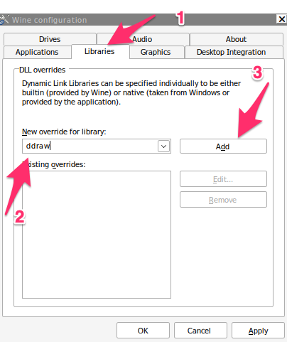
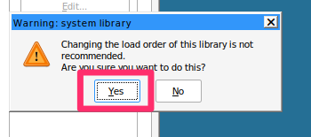

# Red Alert 2 Menu not loading with Wine

## Introduction
We will go through the steps of fixing the Red Alert 2
menu not loading on wine
{: style="width:80:px"}

## Fix
* Download [cnc-ddraw](https://github.com/CnCNet/cnc-ddraw/releases/download/v4.4.7.0/cnc-ddraw.zip)
* Extract the zip file in the RA2's directory

open your terminal and type in:
```bash
winecfg
```
Click on "Libraries" and in New overrides for library type in "ddraw" and then click on Add
{: style="width:80:px"}

You will get a warning click on "Yes"
{: style="width:80:px"}

Click on Apply and then ok. You can now launch the game.


