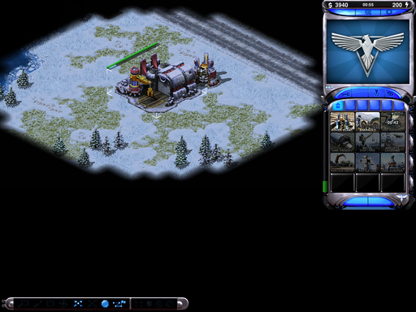

# Play Red Alert 2 on a Ubuntu

## Introduction

I play Red Alert 2, and have been strugglin g to get it working on recent versions of wine. I use a modified version of openra to play, which I found was great at giving me the added bonus of a "remastered" feel to the game.

{: style="width:150:px"}

## Install

First we need to install Microsoft dotnet.

Add the Microsoft Repo:
```bash
wget https://packages.microsoft.com/config/debian/11/packages-microsoft-prod.deb -O packages-microsoft-prod.deb

sudo dpkg -i packages-microsoft-prod.deb

rm packages-microsoft-prod.deb

```

Now install dotnet 6

```bash
sudo apt-get update &&   sudo apt-get install -y dotnet-sdk-6.0
```

Now download OpenRA with the ra2 mod

```bash
cd ~
wget https://github.com/OpenRA/ra2/archive/master.zip
unzip master.zip
cd ra2-master
make all
```

Create the game directory

```bash
mkdir -p ~/.config/openra/Content/ra2
```

Copy the game files

```bash
cp -r ~/Games/RedAlert2/* ~/.config/openra/Content/ra2/
```

Launch the game with

```bash
./launch-game.sh
```


