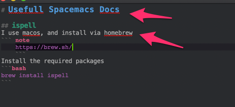
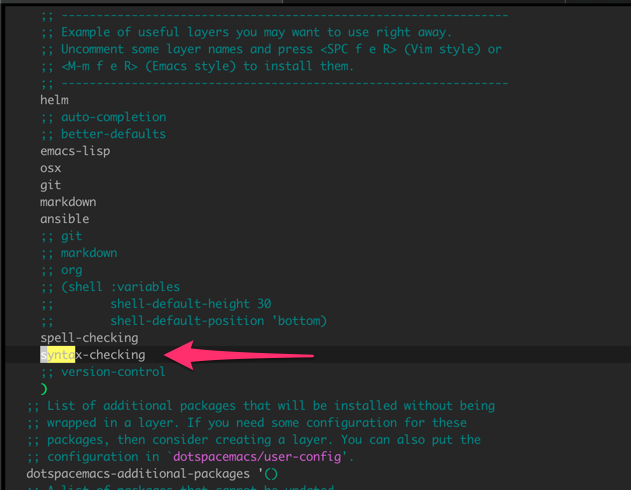

# Usefull Spacemacs Docs

## ispell
I use Macos, and install via homebrew

!!! tip
    https://brew.sh/

Install the required packages

```bash
brew install ispell
```

For ubuntu and Debian based operating systems use:

```bash
sudo apt-get install ispell
```

Now open spacemacs and toggle ispell with

<kbd>Space</kbd>+tS

Reload spacemacs config:
<kbd>Space</kbd>+feR

Check and highlight all errors
<kbd>Space</kbd>+Sb

You will now have the red underlines on miss spelt words

{: style="width:150:px"}

## Increase font size

<kbd>Space</kbd>+ f e R

Search for 
```bash
dotspacemacs-default-font
```

increase the :size property to a more comfortable one.

Reload with

<kbd>Space</kbd>+ f e R

## Search and Replace

<kbd>Space</kbd><kbd>Space</kbd>anzu-query-replace

To replace all text hit <kbd>!</kbd>+<kbd>Enter</kbd>

## Shellcheck

Shellcheck is a great application to ensure your bash script comply to standards. To install this in Spacemacs on a mac do the following:

```bash
brew install shellcheck
brew install python
```

Now install bashhate
```bash
pip3 install bashate
```

Install syntax checking in spacemacs

<kbd>Space</kbd>+fed

uncomment "syntax-checking"
{: style="width:150:px"}
