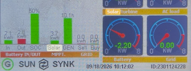
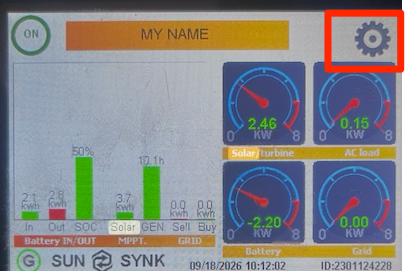
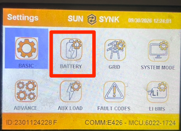
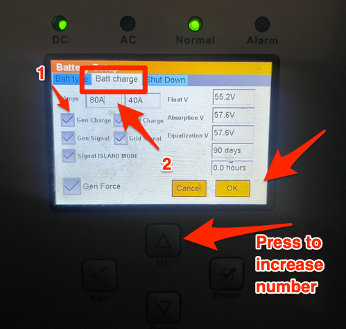

# SunSynk with a generator battery capped
## Introduction
I had an issue where I had a generator added to my SunSynk inverter,
however when I ran the generator, the batteries would not charge past 2KW, instead of the full 5.5KW that the generator produced.
{: style="width:150:px"}

I knew it had to be a setting as on solar, the batteries charge past 5KW.

## Setup
Tap on the Gear Icon on the top right
{: style="width:150:px"}

Tap on the Battery icon
{: style="width:150:px"}

!!! note
     Use this formula to find a safe starting current:
     ```
     10A = +-500W
     ```

So if you have a 5KW generator, set the value to 99A

Tap the block next to “Gen Charge” to put a tick in the block.
The first block next to amps that was greyed out will now turn white. Tap in this block to change the value.
Press the up button to increase this value.
Click on “OK” to Apply
{: style="width:150:px"}
