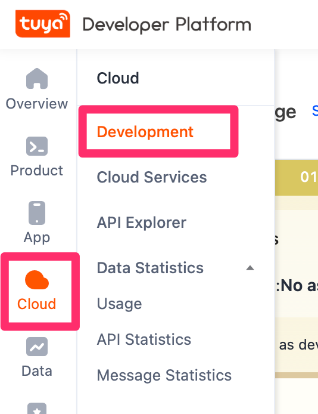
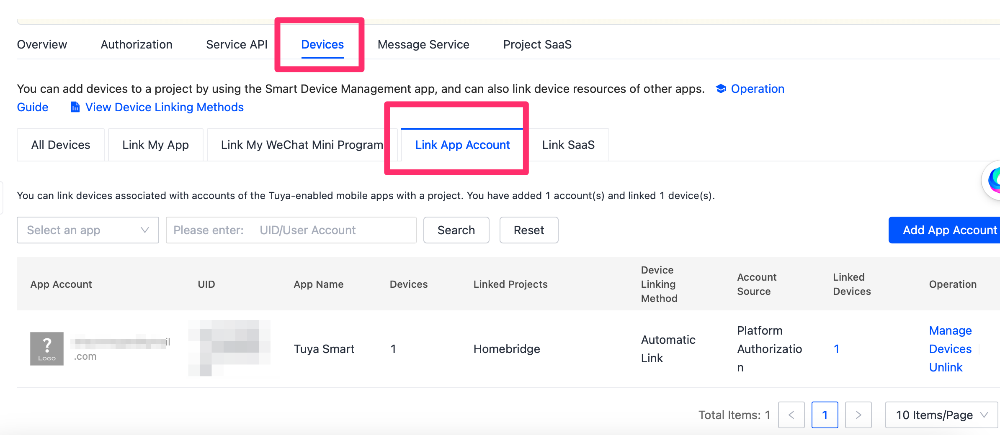
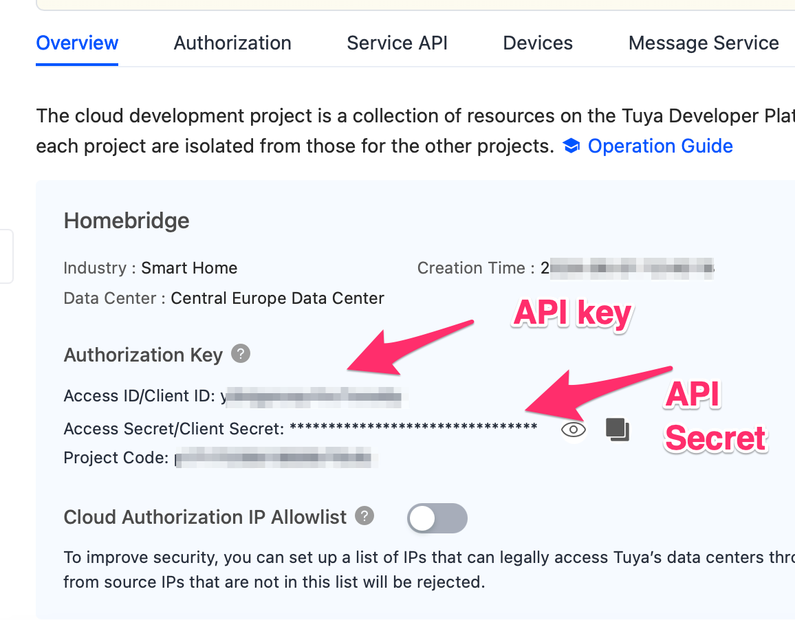
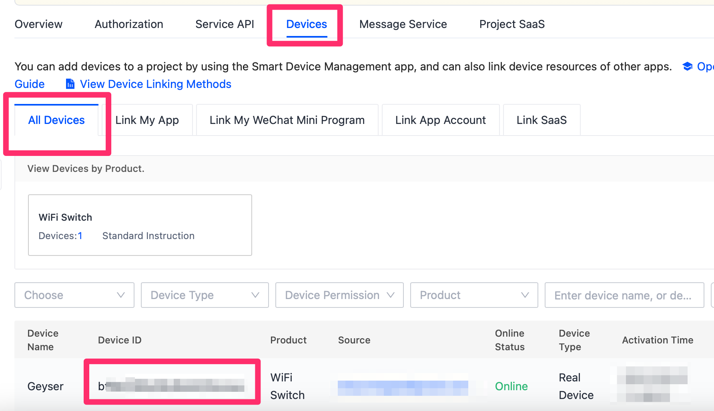

# Configure a Tuya smart switch to run locally and connect it to homebridge.

## Introduction

I initially setup the Tuya smart switch cloud to connect to homebridge, just to find out a month later that it was a trial and that the cost would be $25 000 a year.

We will go through the instructions on how to connect locally to the Tuya switch via homebridge.

## Setup Device

!!! note
    You need to have an existing cloud setup
    https://developer.tuya.com/en/docs/iot/smart-home-quick-start?id=Kbvwrxn6mngbd
    
Log onto the Tuya platform

Go to Cloud -> Development and click the project you created earlier.
{: style="width:80:px"}

Click the "Devices" tab. Click the "Link App accounts" tab, and select the right data center in the upper right dropdown (eg Western America).
{: style="width:80:px"}

Click "Add App Account" and scan the QR code from your smart phone/tablet app by going to the 'Me' tab in the app, and tapping a QR code / Scan button in the upper right. Your account will now be linked.

## Get API key and API secret

Go to Cloud -> Development and click the project you created earlier.
{: style="width:80:px"}

Click on Overview:

The "Access ID/Client ID" is your API key
The "Access Secret/Client Secret" is your API Secret
{: style="width:80:px"}

To get the Virtual ID:
Click on "Devices" > "All Devices"
{: style="width:80:px"}


## Connect

From your homebridge server running on your Raspberry Pi run the following commands:

```bash
ssh pi@homebridge.ip.address

sudo apt-get install npm

sudo npm i @tuyapi/cli -g
```
!!! note
    Get the info for the wizard from te step above:
    
```bash
tuya-cli wizard
```
{: style="width:80:px"}
