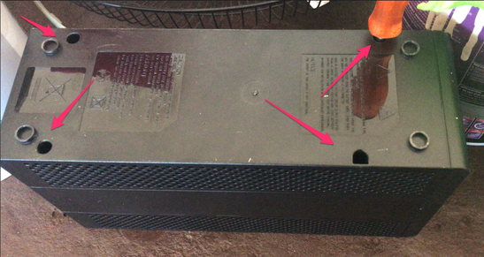
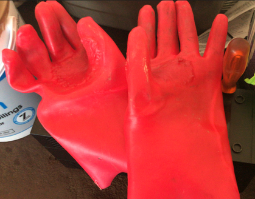
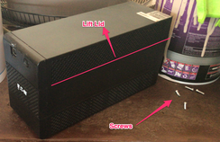
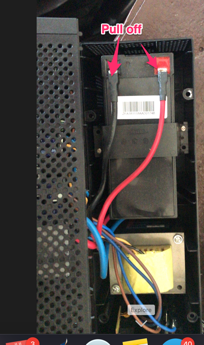
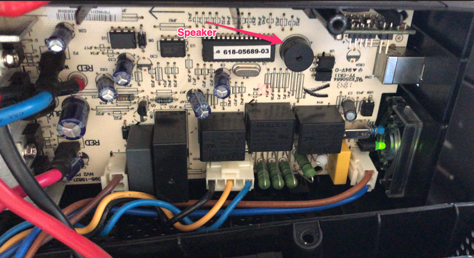
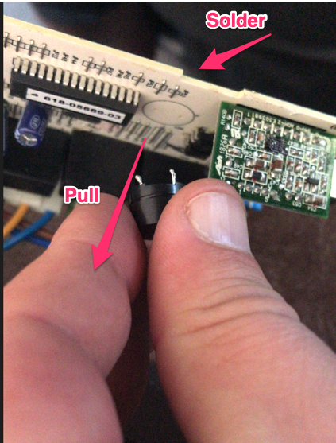

# Removing speaker from Eaton ups
## Introduction

I live in a country where power supply is not stable, and got sick and tired of the beeping from the
UPS waking me up at 2 in the morning. I used to use nut to software disable the beeping speeker,
but when the ups runs flat it resets this setting, so I decided to physically remove the speaker.

## What you need

!!! warning
    This is high voltage power, wear rubber gloves for your own safety!
    This will void your warranty and is potentially dangerous.
    I take no liability for this.
    
* Rubber gloves
* Phillips screwdriver
* Soldering Iron
* Eaton UPS

## Removing the speaker

Turn the UPS upside down and uncrew the 4 screws with the Phillips screwdriver.

{: style="width:150:px"}

Before pulling apart the case, put your rubber gloves on!

{: style="width:150:px"}

Turn the ups over, be carefull as the screws will fall out the bottom, and lift the lid. The circuit board is in the lid.

{: style="width:150:px"}

Remove the power cables from the battery, for your safety.

{: style="width:150:px"}

Pull the board out of the case. There is a round black speaker attached to the board. This is what we are going to remove.

{: style="width:150:px"}

Hold the board from the speaker, pulling it away from the board. With your otherhand use the soldering iron to melt the solder
holding the 2 pins on the board, you may need to jiggle the speaker a bit to get it out.

{: style="width:150:px"}

Once done, clip the board back into the plastic housing, put your gloves on and then reconnect the battery, and place the lid back on.
Flip the UPS and screw back in the screws.

