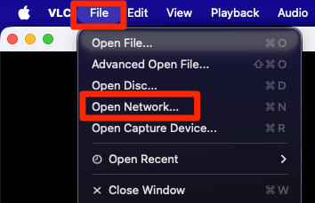
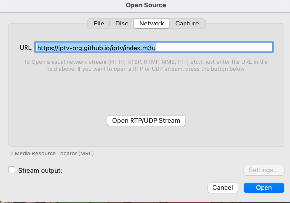
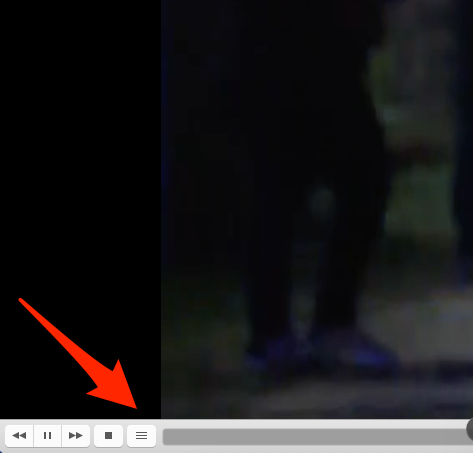
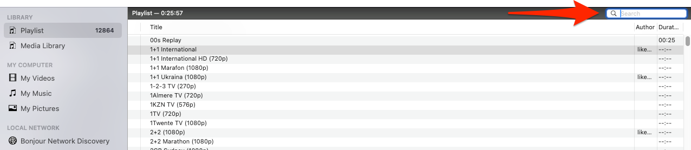

# Install IPTVon VLC
IPTV is a rep that allows you to watch worldwide television on your local vlc machine.
TheGitHub repo is here:
``` bash
https://github.com/iptv-org/iptv
```

Open VLC and click on "File" > "Open Network"
{: style="width:150:px"}

Paste the URL and then click on "Open"
```bash
https://iptv-org.github.io/iptv/index.m3u
```
{: style="width:150:px"}

A channel will start playing. To change to another station click on the 3 line burger menu
{: style="width:150:px"}

Now search the the channels you want to watch, or click on search and search for a channel.
{: style="width:150:px"}
