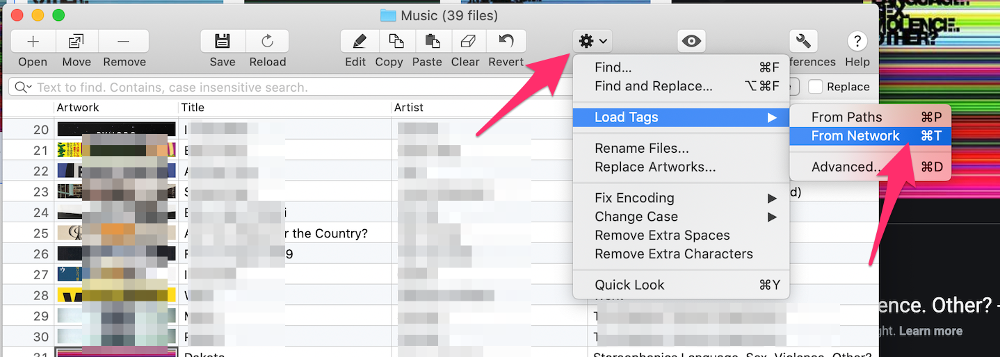

# Installing youtube-dl on Macos

We will go through the steps of installing and using youtube-dl on mac

## Install

```bash
brew install youtube-db
```

## Usage

```bash
youtbe-dl "https://www.youtube.com/watch?v=4zKjJ0MKL50"
```
## Convert to mp3

```bash
ffmpeg -i tCm4XB-hZ2I.flv -f mp3 -ab 192000 -vn music.mp3
```

## Album Tags

Download tag editor from the app store

!!! note
    https://apps.apple.com/us/app/tag-editor-free/id984278082?mt=12
To automatically fill in your album details do the following:

Click on the Gear (settings) then click on Load Tags Then click on "From Network"

{: style="width:150:px"}
