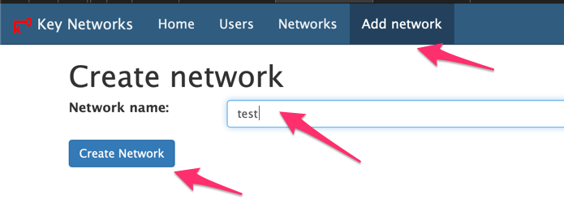

# Administer your Zerotier Server
# Basics
Access your zeroteir admin console with the following
!!! tip
    http://yourdomain.com:3000/

    Username: admin

    Password: password

## Create an Admin user
Click on "Users" > "Create User""

{: style="width:80:px"}

Now fill in the details, and when done click on "Set Password". You will now be able to login with this user

{: style="width:80:px"}

## Setup a network
Click on "Home" > "Add Network"
Put in a name, and then click on "Create Network"

{: style="width:80:px"}
The network ID is what you send to your users, they will enter this id in to connect to the network
They can connect using this guide to [Join a network](https://shaunmegaw.co.za/zerotier_client/#join-a-server)

{: style="width:80:px"}

Now setup the addressing by clicking on "easy setup" marked on the screenshot above
Click on "Generate network address", it will auto populate the fields, and then
click on "Submit"

{: style="width:80:px"}

## Authorize A New User

Once a user has connected via the eroTeir client, they will need to be authorized
before they can join your network. To do this run the following

Click on "Networks" scroll to your network name, and then click on "Members" 

{: style="width:80:px"}

You will see the users request. Give them a friendly name, tick "Authorized" and tick "Active bridge".
{: style="width:80:px"}
