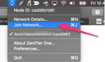
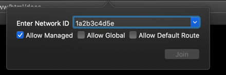

# Install & Setup the Zeroteir client
## Client Download
Download the client software for your operating system

!!! tip
    https://www.zerotier.com/download/

## Join a server
Click on the ZeroTier application and then click on "Join Network"

{: style="width:150:px"}

!!! note
    Obtain the network ID from an administrator,
    or if you are the administrator from your server
    create a new network with this guide [Create a network](../zerotier_admin/#setup-a-network)
   
Now paste in the Network ID which has been provided you, or generated by you.

{: style="width:150:px"}
