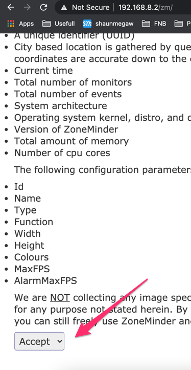

# Zoneminderi Rasbian homebridge intergration

## Introduction

We will go through setting up a camera in homebridge for use in Apple homekit, using zoneminder (to store video) and 
point the plugin at Zoneminder server via its ffmpeg API and export any camera that you want to HomeKit.

We installed zoneminder on our homebridge server using this wiki

!!! note
    https://shaunmegaw.co.za/homebridge/
    
## Zoneminder

ssh to your homebridge server

```bash
ssh pi@192.168.8.2
```

Install zoneminder

```bash
sudo apt-get update
sudo apt-get install zoneminder apache2 mariadb-server vlc-plugin-base php libapache2-mod-php php-mysql
```

Setup the mysql database

```bash
sudo mysql_secure_installation
```
Configure Zoneminder

```bash
sudo mysql -uroot -p < /usr/share/zoneminder/db/zm_create.sql
sudo mysql -uroot -p -e "grant all on zm.* to 'zmuser'@localhost identified by 'zmpass';"
sudo mysqladmin -uroot -p reload 
sudo chmod 740 /etc/zm/zm.conf 
sudo chown root:www-data /etc/zm/zm.conf
sudo chown -R www-data:www-data /var/cache/zoneminder/
sudo systemctl enable zoneminder.service
sudo adduser www-data video
sudo systemctl start zoneminder.service
sudo systemctl status zoneminder.service
sudo a2enmod cgi
sudo a2enmod rewrite
sudo a2enconf zoneminder
```

Add your timezone to php

```bash
sudo vi /etc/php/7.3/apache2/php.ini
```
change

```bash
[Date]
; Defines the default timezone used by the date functions
; http://php.net/date.timezone 
date.timezone = Africa/Johannesburg
```

Restart apache to  apply

```bash
sudo systemctl enable apache2.service
sudo systemctl restart apache2.service
```

## Zoneminder Gui setup

Access zoneminder via your web browser (change the ip to your Rasbian server ip.

!!! note
    http://192.168.8.2/zm/
    
Accept the Privacy notice

{: style="width:150:px"}


